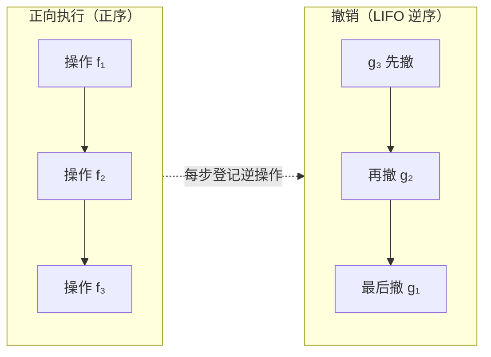
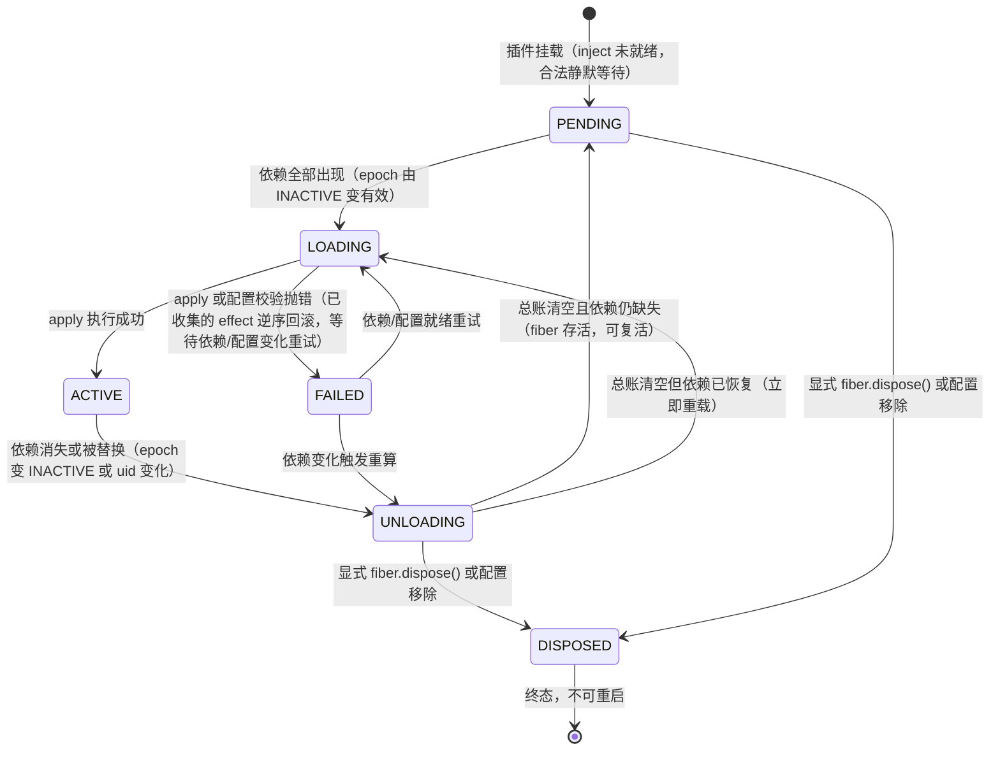
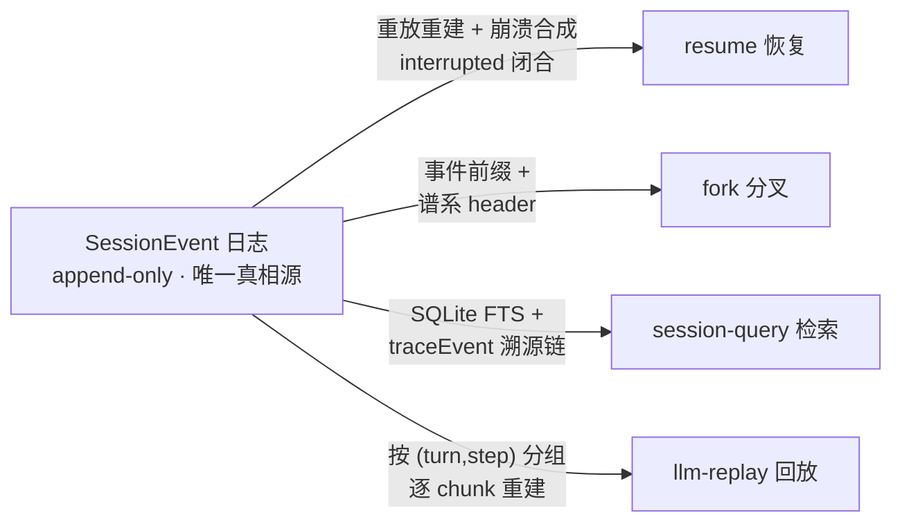
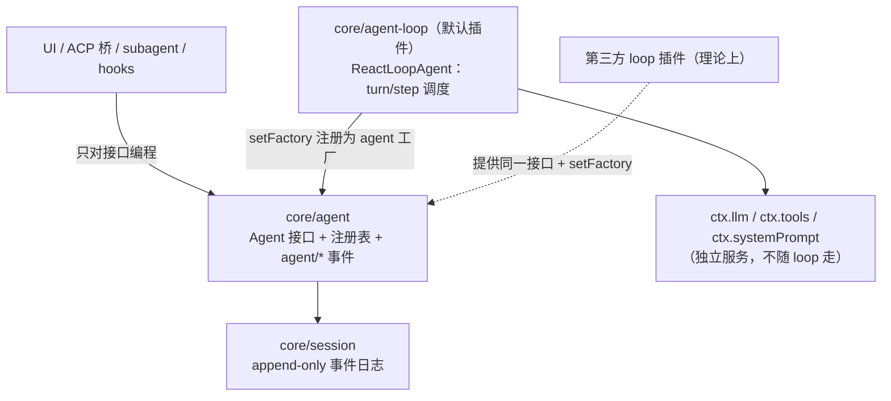
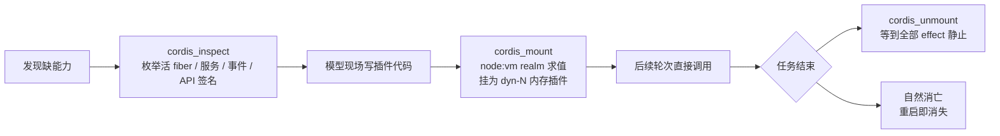

## 1. dsh 到底是什么：不是“DeepSeek 版 Claude Code”

### 1.1 发布事实与官方定位

#### 1.1.1 现象级发布：一次“涨星纪录”背后的事实清单

2026 年 8 月 13 日，DeepSeek 将 DeepSeek Harness（命令行名为 `dsh`）以 MIT 协议开源，官方口径为“v0.1 开发者预览版，面向全球 Harness 开发者开放测试”。热度先摆出来：发布后约 1.5 小时 GitHub Star 突破 2.4 万，被快科技称为“GitHub 史上涨星速度最快的项目”；不到 24 小时超过 7 万星；Hacker News 讨论帖以 555 分、241 条评论登顶，团队负责人崔添翼亲自回帖征集反馈。这些星数是第三方 48 小时内的快照，不是官方披露——说明“现象级热度”足够了，当精确统计看就过了。

这组数据的含义不止于“火”。一个尚未发布正式版、官方明示将有破坏性变更的预览项目，在一天内获得的关注度超过了许多成熟产品数年的积累——社区押注的对象显然不只是一个工具，而是它背后代表的那个新品类。

#### 1.1.2 官方公式：Agent = Model + Harness

DeepSeek 在官网为 harness 单独开设了产品页，开宗明义写下一个公式：“Agent = Model + Harness”，并给出定义——“模型是智能体的灵魂。Harness 让智能体理解环境、使用工具、在真实场景中持续工作”。这个公式并非发布当天的营销话术，其最早出处是 2026 年 5 月 DeepSeek 的公开招聘启事，其中明确写道“除模型本身以外的所有工作，都属于 Harness 的范畴”。换言之，“Harness”在 DeepSeek 的内部话语里，从立项之初就是与“模型”并列的一级概念，而非某个产品的名字。

#### 1.1.3 发布脉络：从更新日志脚注到“三连发”

dsh 的首次官方亮相并不在发布会上，而藏在一个脚注里。2026 年 7 月 31 日 V4-Flash 正式版的 API 更新日志中，官方加注：公开基准中的 Code Agent 任务“使用 DeepSeek Harness 极简模式（即将发布）作为测试框架”。到 8 月 13 日，DeepSeek 同日完成三连发：V4-Pro 正式 GA、宣布 API 峰谷定价（8 月 16 日生效，谷时半价）、当晚开源 dsh。VentureBeat 在报道中点破了其中的关键关联：V4-Pro 的 Code Agent 基准同样用 dsh 极简模式测出，这意味着这些分数是“模型 + Harness”的组合成绩，而非裸模型成绩。这是理解 dsh 战略位置的第一块拼图：它先以“官方评测脚手架”的身份存在，然后才以“开源产品”的身份面世。

下表汇总 dsh 的基本信息，供后续章节引用。

| 维度 | 内容 |
|---|---|
| 定位 | 开源 Agent Harness（智能体运行层），官方公式 Agent = Model + Harness |
| 开源协议 | MIT |
| 仓库 | GitHub `deepseek-ai/deepseek-harness` |
| 包名 / 运行方式 | npm `@deepseek-ai/dsh`，Node.js 22+，CLI / Web UI / headless / Python SDK |
| 版本状态 | 宣传 v0.1 开发者预览；实际包版本 0.1.0-rc.5/rc.6，无 GitHub release/tag |
| 架构基底 | Cordis 元框架驱动，“一切皆插件”，无特权核心 |

**解读**：这张表里最容易被忽略的是最后一行与倒数第二行的张力：一个连正式 tag 都没有的 rc 版本，却背着一套完整的元框架架构。这说明 DeepSeek 发布的是“地基”而非“成品”——协议（MIT）与仓库结构服务于生态共建，版本状态则诚实地标明了它离生产可用还有多远。读者在后续章节看到任何精巧设计时，都应同时记住这两行。

### 1.2 Harness 这个品类的本质

#### 1.2.1 Harness = 包裹模型的运行时层

“Harness”原义是马具——套在马身上、把马的力量传导到车轮上的那套挽具。这个隐喻精确得近乎苛刻：马提供力量，但方向、刹车、载荷分配全部由挽具决定。套用到 AI 上，Harness 是包裹模型的运行时层：它调度上下文（决定模型每一轮“看见”什么）、管理工具（决定模型能“碰”什么）、维护任务状态（决定多轮之间什么被记住）、收集反馈并划定边界（权限、沙箱、审批），最终完成从理解需求到交付结果的闭环。

由此可以划清它与两个邻近概念的界限：framework（框架）是给开发者写代码用的抽象，而 harness 是模型“住在里面”的运行环境；CLI 只是 harness 可能长出来的一种交互界面，正如 dsh 同时提供 CLI、Web UI 与 SDK。多数社区文章说不清这个区别，是因为此前这个品类没有独立名字——它一直寄生在“coding agent 产品”的外壳里被一并售卖。

#### 1.2.2 对标 Claude Code 是表象，定义品类才是实质

“DeepSeek 版 Claude Code”是流传最广、也最表层的误读。这个类比只对了一句话：两者都是终端里可用的 coding agent。但架构哲学完全不同——Claude Code 与 Codex 的 agent loop（模型与工具之间“思考 - 行动 - 观察”的循环）都写死在各自核心中、不可替换；而 dsh 连 loop 本身都是一个可替换的普通插件。这一差异的机制细节留给第 2 章与第 7 章展开，此处只需记住：对标的是产品形态，分叉的是架构哲学。

更深一层的定位来自官方与媒体的双向印证。官方公告只字未提任何对标对象，而是强调“没有特权核心”、邀请全球开发者“共建 DSH 插件生态”；36 氪的解读则直言其打法是“不跟你比谁的缰绳编得好，直接宣布缰绳这个东西不该收钱”——如同 R1 对准闭源模型溢价，dsh 对准的是闭源 harness 外壳的溢价。这正对应官方公式中被忽略的后半句逻辑：模型决定 AI 能做什么，Harness 决定 AI 如何把事情做完。DeepSeek 开源的不是又一个产品，而是把这个品类本身变成了公共基础设施。

### 1.3 预览版成色与官方警告

#### 1.3.1 全大写警告与“地基优先”立场：该怎么看待 v0.1

判断 dsh 价值的前提，是先看清它此刻的成色。README 以全大写明示：“THERE WILL BE COMPATIBILITY-BREAKING CHANGES”（将出现破坏兼容性的变更）；宣传的“v0.1”实际对应 npm 上的 0.1.0-rc.5/rc.6，仓库没有任何 release 或 git tag 钉住版本。更直白的是 AGENTS.md 中一段标注“在首个带 tag 的正式版前删除本节”的预发布立场：在没有外部消费者时，“优先正确的地基而非兼容垫片”，可自由重命名、重新打包，会话格式版本保持为 0 且不作任何兼容承诺。

把这三条证据放在一起，官方态度可以概括为一种罕见的坦率：它主动拆掉了“拿来即用”的预期，把“不确定性”写在了门口。对读者来说，这意味着——当前版本适合用来学习架构、试水插件、参与生态共建，而不适合锁定进生产系统；社区的兼容性追踪实测（运行级实测 5 个插件、0 个可用）也从侧面印证了这一判断。但反过来，“地基优先”恰恰意味着此刻读到的架构决策（一切皆插件、append-only 会话日志、可逆副作用）最可能原样进入正式版——现在正是深入理解它的最好时机，后面十章也从这里出发。

这十章的行进逻辑，是专为“读了很多分析仍然迷路”的读者设计的：先解决“它为什么被设计成这样”——第 2 章讲“一切皆插件、无特权核心”的设计理念，第 3 章引入论文给出的理论框架“时空可组合性”；再拆开机器看内部——第 4 至 6 章依次讲透三根机制支柱：可逆插件机制（注册即记账、卸载即回滚）、协作机制（反应式依赖注入与类型化事件）、事件溯源会话（append-only 日志是唯一真相源）；随后正面迎战那个最硌人的哲学追问——第 7 章回答“loop 可换，这还是不是 agent”；接着把镜头拉远——第 8 章讲运行模式与自进化能力，第 9 章在架构谱系中横评 dsh 与 Claude Code、Codex 等的位置，第 10 章盘点社区反响、争议与风险；最后第 11 章回到起点，把萦绕在每位读者心头的五个疑问逐条清算，给出本质判断。迷路往往不是因为缺少信息，而是因为信息没有顺序——这条路线就是顺序。

## 2. 设计理念：一切皆插件，并且没有特权核心

很多读者读完 dsh 的介绍文章后留下的印象是“又一个插件系统”。这个印象只对了一半。插件系统不新鲜——VSCode、webpack、Eclipse、Obsidian 都有；dsh 真正独特的地方不是“有插件”，而是**插件化覆盖率达到了 100%，连系统主干本身也是插件**。本章先把官方“一切皆插件”（everything is a plugin）的完整含义讲清楚，再解释为什么“没有特权核心”（no privileged core）才是它与传统架构的根本分野，最后引出支撑这一切的 Cordis 元框架。

### 2.1“Everything is a plugin”的完整含义

#### 2.1.1 官方列举

dsh 的 README 只用一句话描述自己的架构：“It uses an architecture where **everything is a plugin**”。这句话的字面含义在官网的产品页被展开成一份清单：模型（models）、工具（tools）、技能（skills）、会话（sessions）、沙箱（sandboxes）、存储（storage）、循环（loops）、调度（scheduling）以及 UI——“Plugins provide every agent capability”，即 Agent 的每一项能力都由插件提供，而不是由某个内置核心提供。

官方公众号的发布公告进一步说清了“由插件提供”在工程上意味着什么：Cordis 元框架只负责插件的加载、卸载与依赖关系，Agent Harness 的所有具体组件都是不同的 Cordis 插件，插件之间通过 Cordis 的服务与事件协作，可以在配置层自由组合；“开发者无需改动 DeepSeek Harness 的源码本身，就能以插件的方式独立选择、替换或扩展其中的任一能力”。这里有一个容易被读漏的限定：替换的方式是**在配置层换一行挂载记录**，而不是 fork 仓库改源码。这个限定是理解后文“无特权核心”的关键。

#### 2.1.2 核心包解剖

“一切皆插件”不是口号，它在仓库里体现为：那些在任何其他 Agent 框架里会被写进“内核”的东西，在 dsh 里都被做成了独立包，各自是一个 Cordis 插件。官方架构文档给出的核心包清单如下：

| 核心包 | 职责 | 一句话解释 |
|---|---|---|
| `core/session` | append-only 会话事件日志，持久化的唯一真相源 | 模型看到的每一条信息都先记账，会话的恢复、分叉、回放都从这本账重建 |
| `core/system-prompt` | 系统提示词组装服务 | 模型每轮看到的“出厂说明”是动态拼装出来的，拼法本身可替换 |
| `core/tools` | 工具注册表与守卫管线（pre-execute → execute → post-execute → result） | 工具执行的“海关”：权限、沙箱、审批都在这里把关，与具体 loop 无关 |
| `core/agent` | Agent 接口契约、运行中注册表与 `agent/*` 事件词汇 | 只定义“agent 长什么样”，不定义“agent 怎么跑” |
| `core/agent-loop` | 上述接口的默认驱动实现（ReactLoopAgent） | 真正“调模型、跑工具、重复”的循环——但它也只是契约的一个默认实现 |
| `llm/llm` | 模型适配层（`ctx.llm` 服务 seam） | 把不同模型供应商统一成一个可替换接口，换模型 = 换适配器插件 |
| `core/scope` | 按 agent 划分作用域的注册原语（零依赖库，无 `ctx` 键） | 同进程多 agent 的注册路由原语（非沙箱） |

这张表里最值得停下来看的是中间两行的分工。`core/agent` 的 README 开宗明义：所有插件（UI、hooks、编排器）都面向这里定义的 `Agent` 句柄编程，“it has zero loop dependency, so the loop is swappable”——契约与循环零依赖，所以循环可换。而 `core/agent-loop` 作为默认实现，在源码里就是一个普通的服务插件：`export class AgentLoop extends Service implements AgentFactory`，通过 `static inject = ['agents', 'sessions', 'llm', 'tools', 'systemPrompt']` 声明五个依赖，再把自己注册为 agent 工厂。也就是说，“主干”与“枝叶”之间没有架构地位之差，只有“谁先被挂上树”的先后之差。注意一个反直觉点：这张表里没有一行是“不可替换的内核”——`core/*` 的命名暗示“核心”，但它们在 Cordis 眼里的身份与你写的第三方插件完全相同，区别仅是官方发行版默认挂载了它们。

### 2.2 与传统“核心 + 挂件”架构的根本分野

#### 2.2.1 对比 Codex 阵营

要理解 dsh 的分野，先看行业常态。以 OpenAI Codex 为代表的一派选择了编译期确定的单体核心：Codex CLI 从 TypeScript 重写为 Rust，官方给出的理由是零依赖安装、原生沙箱绑定（Seatbelt/Landlock）、无 GC 的低内存占用与基于 wire protocol 的扩展。在这条路线里，agent loop 是编译进二进制的一段裸循环——源码级证据是 `codex-rs/core/src/tasks/regular.rs` 里的 `loop { run_turn(...) }`，外部世界只能通过 MCP、hooks、skills 这类声明式“挂件”与之交互，主干不可触碰。社区对此有一句传神的总结：Codex 交付的是“成品家具”，loop 焊死在椅子里；想换 harness 的行为只能 fork。

VSCode 是这个模式的教科书先例：扩展可以注册命令、监听、状态栏，且 `ExtensionContext.subscriptions` 里的 Disposable 会在扩展停用时统一回收，但编辑器内核本身不可替换——离开所有插件，它依然是一个功能完整的编辑器。这类架构的共同结构是“特权核心 + 边缘挂件”：核心享有不可替换的特权，插件只能在核心划好的边界内活动。dsh 把这个结构倒转了过来：Cordis 是一等公民，主干本身也是插件。官方 coding agent 发行版与社区魔改版在架构地位上**完全平等**——两者都只是“一组被挂载的插件”，没有任何一行代码位于插件够不到的地方。

#### 2.2.2“没有需要打补丁的特权核心”

dsh 官方架构文档对这个分野的表述极其直白：“There is **no privileged core** to patch: you extend dsh by mounting a plugin beside the others, and registrations are effects that unwind when their plugin unloads”——不存在需要打补丁的特权核心，扩展 dsh 的方式是把插件挂载到其他插件旁边，而一切注册都是随插件卸载自动撤销的副作用。

这里需要做一个精确的概念切割：很多人第一反应是“这不就是微内核（microkernel）吗”。像，但不是。以微内核架构的工业标杆 OSGi 为例，其规范明确强制 system bundle **不可卸载**——对框架本体调用 `uninstall()` 必须抛出 `BundleException`；即便普通 bundle，停止后其导出的 package 代码仍留在 JVM 中可被其他 bundle 执行，线程与连接等资源也要开发者在 `stop()` 里手动释放。也就是说，OSGi 的微内核仍然保留着一个享有特权、不可触碰的中心。dsh 把这个中心也削掉了：连 agent loop 都可以替换，拆光所有插件之后什么都不剩。更准确地说，dsh 不是“又一个微内核”，而是把微内核思想推到极限后的形态——中心不再是一个“较小的内核”，而是一个**不提供任何能力、只提供组合规则的元框架**。完整的插件架构谱系对比留待第 9 章，这里只需记住一句话：传统架构的插件覆盖率是“边缘 100%、中心 0%”，dsh 是全局 100%。

### 2.3 Cordis 元框架：只提供组合，不提供能力

#### 2.3.1 论文§5 原话

削掉特权核心之后，剩下的那个“东西”是什么？答案是 Cordis，而且它的自我定义收得非常紧。论文《A Programming Paradigm for Spatiotemporal Composability》§5 开头原话：“Cordis is a meta-framework of spatiotemporal composability: unlike application frameworks that target a specific domain (e.g., web routing, ORM, UI rendering), it prescribes no concrete scenario; **its sole responsibility is to supply universal dynamic composition semantics**”——它唯一的职责是提供通用的动态组合语义。

这句话的分量需要用排除法来读：Cordis 自身不含任何 agent 能力、不含 web 能力、不含聊天能力，它甚至不规定“插件应该长什么样”之外的一切。模型适配、工具管线、会话日志这些“Agent 之所以是 Agent”的东西，全部以插件形式由上层提供。那么“动态组合语义”具体保证什么？通俗地说只有两条：插件做的每件事都能被完整撤销（插件能真正拔掉），插件之间的依赖由运行时自动接线（依赖齐了才激活、提供者要走消费者先退）。这两条语义有严格的理论定义与形式化定理支撑，这是下一章的主题，此处先不展开。

#### 2.3.2 乐高类比

理解 Cordis 与 dsh 的关系，最省力的画面是乐高。Cordis 是那块凸点底板：它不提供任何车或房子的形状，只提供凸点——也就是“积木如何咬合、如何拆下”的组合规则。dsh 的核心包（`core/session`、`core/agent-loop` 等）是官方生产的积木件，而你从社区安装的插件与它们是同一种积木，咬在同一块底板上。官方发行的 Coding Agent，则是官方自己拼好的一辆“预置汽车”。

这个类比不是本文的发明，而是社区一手观察者的原话。Multica CEO Jiayuan Zhang（提前一个月进入仓库的内测者）在发布当天的 X 原帖中写道：官方 Coding Agent 只是官方拼出的预置方案，“你完全可以把里面的零件换成自己喜欢的：换引擎、换轮胎、换挡风玻璃……甚至最后拼出来的东西，也不一定还是一辆汽车”。这句话的后半句值得划重点：换零件的终点可以不是“改装车”，而是完全不同的东西——因为底板不关心你拼的是什么。元框架与框架的区别就在这里：框架给你一个领域的半成品，元框架只给你组合的物理定律。也意味着评估 dsh 的正确姿势不是“这辆预置汽车好不好开”，而是“这块底板的咬合规则是否可靠”——前者是插件集的产品问题，后者才是 dsh 真正押注的架构命题。这套咬合规则为什么值得信任、它的数学保证强到哪里、边界又在哪里，是第 3 章要回答的问题。

## 3. 理论根基：Cordis 论文与“时空可组合性”

dsh 官方 README 把自己的架构思想明确指向两件东西：一个名为 Cordis 的框架，和一篇描述其设计的论文《A Programming Paradigm for Spatiotemporal Composability》。第 2 章讲了“一切皆插件、无特权核心”的工程形态，本章回答它背后的理论问题：这套插件系统凭什么敢承诺“任何组件都能在运行时装上、换掉、拔掉”？先把答案压缩成一句话——**空间可组合性 = 插件之间自动接线；时间可组合性 = 插件能真正拔掉**。全章其余内容都是对这两句话的展开与证明。

### 3.1 论文概况与作者谱系

#### 3.1.1 论文与作者

《A Programming Paradigm for Spatiotemporal Composability》是一篇 88 页的 preprint，以 GitHub 仓库 cordiverse/paper 的 `paper.pdf` 形式发布，标注“Draft of August 13, 2026”，未检索到 arXiv 或会议版本。仓库 README 自述“preprint under active revision, the content may change substantially”，也就是说它尚未经过同行评审，本章引用的形式化结论目前只有论文自己的证明作背书。作者三人：一作 Yifan Shi（北京大学 + DeepSeek-AI 双署名，GitHub 账号 Shigma，公司字段为 @deepseek-ai）；二作 Wei Zhang（张伟，北京大学计算机学院软件研究所副教授，程序设计语言方向）；三作 Tianyi Cui（崔添翼，DeepSeek Harness 团队负责人，曾在 Jane Street 工作九年，同时是 `@deepseek-ai/cordis` 的 npm maintainer）。

#### 3.1.2 Cordis 溯源：从聊天机器人到 DeepSeek

Cordis 不是为 dsh 从零发明的。其 LICENSE 起始行为“Copyright (c) 2021-present Shigma”，npm 包 `cordis` 创建于 2022-04-21，此后约四年一直作为 Koishi 聊天机器人框架的底层插件运行时；按论文口径，Koishi 生态在 Cordis v3 上积累了 4000+ 社区插件。这里先纠正一个流传甚广的说法：部分社区文章称仓库位于“koishijs/cordis”，但 npm 历史版本的 repository 字段从未指向 koishijs——真实迁移路径是 **shigma/cordis（个人仓库）→ cordiverse/cordis（组织仓库）**，koishijs/cordis 目前 404。思想的直接前身是 Shigma 2023 年为 Koishi 官方文档撰写的《可逆的插件系统》，其中已出现“副作用纯化→变换幺半群→effect 同态→restore”的完整雏形，可视作论文 §3.1 的草稿。

2026 年 8 月，DeepSeek 将 cordis v4（上游 4.0.0-rc.7，commit `56b3d4f`）以**源码 vendor** 方式收进 dsh monorepo，整体 rescope 为 `@deepseek-ai/cordis`——作者字段仍是 Shigma，并附带 18 项记录在案的本地修改，其中包括 fiber 生命周期的三处重入处置缺口修复；vendor 理由的官方原话是让 harness“fully owns its framework layer (auditable, patchable, pinned)”。这段谱系的意味在于：dsh 的地基不是真空里的“球形鸡”，而是一个在真实插件生态里被反复捶打四年的机制，连人带码进入 DeepSeek。但也要加一个限定——论文脚注明确说明 Koishi 生产环境跑的是 v3，论文与 dsh 用的是重构过效应/余效应语义与 Loader 的 v4，“核心组合模型两版共享”，但 v4 的新实现本身的生产验证尚浅。

### 3.2 空间可组合性：插件之间自动接线

#### 3.2.1 定义与机制

论文 §1.1 的定义是：空间可组合性即“the ability to declare and reactively manage inter-component dependencies”——组件只需**声明**依赖（“我需要 sessions 服务”），由运行时负责发现、解析并**反应式**地管理：依赖出现即激活、消失即停用、被替换即平滑重启，组件自己不写任何检测逻辑。用电器打比方：电器只声明“我要 220V 插座”，插上即通电、断电即停机、换发电机时平滑切换——电器内部没有一行“轮询电网状态”的代码。其代数基础是论文的 reactive coeffects（反应式余效应）：由于一切上下文变更都流经统一的效应原语，每次变化都能按各组件的依赖声明被分类为 activating / deactivating / neutral，从而驱动生命周期——反应性不是事件总线上的补丁，而是从“变更必经同一通道”这一结构性事实中免费得到的。

### 3.3 时间可组合性：插件能真正拔掉

#### 3.3.1 定义与纠偏

论文 §1.1 的定义是：时间可组合性即“the ability to completely revert a component's side effects upon removal”——组件被移除时，它对共享环境造成的一切修改（资源分配、事件注册、状态变更）能被**完全且安全地撤销**，系统回到“仿佛它从未来过”的状态，且不用重启进程。这里得先纠个偏：社区部分通俗解读把“时间可组合性”说成“会话事件流可回放”，这与论文原义不符。论文的时间维度是**运行时层面插件副作用的可撤销性**；会话事件溯源（append-only 日志 + 重放投射）是 dsh 在应用层搭建的另一根支柱，两者互补但不应混为一谈。

#### 3.3.2 为什么传统插件做不到

论文 §1.2.1 以 VSCode 为靶子给出实证（数据取自 2026-06-09 的 Marketplace）：按安装量排序的 Top 100 扩展中，**87 个**含可执行代码，卸载必须重启整个扩展宿主；`deactivate` 钩子只在进程终止时被调用，且把“回收”与“注册”分离在两处代码里，违反 locality of concern（关注点就近原则）；Top 100 中仅 **7 个**声明了非内置的 `extensionDependencies`；跨扩展交互的 `exports` 返回值是无类型的 `any`。这组数字说明的是同一件事：主流插件系统把“撤销”当作开发者的事后义务而非运行机制——注册一行、清理另写一行，漏写就是泄漏；依赖靠文档约定而非运行时管理，卸载只能靠重启进程这把“大锤”。Cordis 的对策正是把逆操作与操作写在同一处（`ctx.effect` 的回调就地返回 disposer），让组合自动派生撤销。

### 3.4 范畴论符号的大白话翻译

论文 §3 的符号劝退了不少读者，但它们其实是一套**记账规则**。下面逐条翻译。

#### 3.4.1 ∂Γ = 环境状态 + 撤销账本

论文定义 2 给出 `∂Γ ≔ Γ × (Γ → Γ)`：在环境状态 Γ 旁边挂一本“撤销账本”——每做一个操作 $f$，同时在账本里登记它的逆操作 $g$，系统状态因此是“（当前状态，恢复累积器 φ）”的二元组。类比会计里的复式记账：每记一笔支出，同时记一笔对应的冲销凭证。账本不是附加文档，而是状态的**组成部分**——这是后面一切保证的地基。

#### 3.4.2 twisted composition 与 track 同态

组合两笔账时，论文定义 1 给出 twisted composition：

$$(f_1, g_1) \circ (f_2, g_2) = (f_1 \circ f_2,\ g_2 \circ g_1)$$

正向操作按正序执行，逆操作按**相反顺序**累积——后进先出（LIFO），像一叠盘子：正着摞上去，倒着取下来。定理 5 证明 `track` 是 monoid homomorphism（幺半群同态），翻译成大白话：**账本记账的方式与操作组合的方式严格一致**——先组合操作再查账，和边做边记账，结果相同。由此定理 16 保证按 LIFO 顺序撤销无需任何额外假设即可精确恢复；换言之，“完整恢复”是**结构性保证**，不依赖开发者自觉写 cleanup。



#### 3.4.3 观测等价：恢复到什么程度算恢复

物理状态不可能真正复原——malloc/free 之后堆布局已经改变，生成的名字不会复用。论文 §3.3.2 的答案是观测等价 $\simeq$：恢复的判定标准是**任何观察者通过合法操作都分不出差别**，而不要求内存逐字节复原。这类似忒修斯之船：船板全换过一遍不要紧，只要它对外的行为与原来那艘不可区分，就“是”原来那艘。这个定义把“恢复”从不可能完成的物理任务，变成可证明的行为学命题。

#### 3.4.4 四大元定理通俗版

论文 §4.4 把单组件的可撤销性推广到整个系统，得到四条元定理：

| 元定理 | 形式化含义 | 大白话 | 工程意义 |
|---|---|---|---|
| 恢复精确性（Th.61/62） | 交错执行下，fiber 的累积器只撤销自己的贡献；离去 fiber 对状态的贡献为零 | 退房只退自己的押金，不动别人的 | 插件可以放心热拔，卸载不伤及无辜组件 |
| 顺序性（Th.63） | 消费者激活必在 provider 之后；provider 的撤回等所有消费者 teardown 完成才生效（`relied` guard） | 启动时先供电再开机；停机时先关机再断电 | 依赖方拆解时把连接归还给提供方，此刻提供方的连接池仍然可用 |
| 进展性（Th.66） | 依赖图无环且迭代有限，则系统必然到达 quiescent（稳定态），guard 必释放 | 只要依赖不成环，就不会死锁 | 循环依赖可从声明静态预测，加载期直接报错 |
| 汇合性（Th.73） | 同一编排动作序列的任何交错执行，最终状态与“按最终配置静态装配”一致（精确到重命名与 ≃） | 无论中间怎么增删，终态殊途同归 | 可以把动态系统当静态系统来推理 |

四条定理有清晰分工：前两条管“单个组件的来去”（不害人、不乱序），后两条管“全系统的行为”（不卡死、可归约）。其中**汇合性是工程杠杆最大的一条**——论文称它是“把 Cordis 应用当静态装配系统推理的许可证”，dsh 的 HMR 与配置增量协调的正确性正是逐条背靠这组定理。但请记住这些保证的前提：论文 §5.1.1 明示，逆操作是否真的能撤销其效应，是**组件作者的义务**，运行时不做语义验证——Cordis 提供的是“不漏调、不乱序、级联有序”的结构性保障，不是魔法。

至此，理论层面承诺了什么已经清楚：空间维度给“自动接线”，时间维度给“可逆撤销”，四条元定理把两者从单组件扩到全系统。承诺如何在社区拆解出的约 2000 行 TypeScript 里兑现——disposer 如何入栈、Fiber 状态机如何驱动、`relied` guard 落在哪一行——是第 4 章的源码之旅。

## 4. 实现原理 I：可逆插件——拔掉一个插件，影响如何全部恢复

第 3 章在理论层面承诺了“完整恢复”：每一次上下文变换都必须携带一个逆操作，由运行时追踪，恢复是结构性保证而非开发者的自觉。本章回答那个最直观的问题——“一个插件把系统改得乱七八糟，它造成的所有影响怎么就能恢复？”——先把一句话版答案放在这里：**dsh 并不是记录插件运行期间的所有内存改动再逆向回放（那不现实），而是要求每个插件在注册每一项功能的同时，上交一份“撤销说明书”（disposer，即逆操作函数）；系统把这些说明书按插件记账，插件被拔掉时，逆序执行它自己的全部说明书**。影响的恢复是“事前约定”，不是“事后追踪”。下面用 dsh 内置的 vendored Cordis 源码（`vendor/cordis/`，上游为 cordiverse/cordis 4.0.0-rc.7）逐层兑现这句话。

### 4.1 核心机制：注册时配对登记逆操作

#### 4.1.1 一切经 ctx 的注册内部都走 ctx.effect()

插件与系统的所有交互都要经过上下文对象 `ctx`：监听事件用 `ctx.on`，提供服务用 `ctx.provide`，挂载子插件用 `ctx.plugin`，修改上下文行为用 `ctx.mixin`/`ctx.accessor`。这些 API 形态各异，但源码上它们内部全部归约到同一个原语 `ctx.effect(execute)`：`execute` 立即执行、完成“正向”注册，同时必须返回一个 disposer——也就是这项注册的撤销说明书；这个 disposer 随即被推进当前插件 fiber 的 `_disposables` 总账。论文将此形式化为 revertible effects：每次上下文变换都携带一个逆操作，且记账方式与操作组合方式严格同构，因此“完整恢复”是结构性结论。

这不是理论修辞，可以直接验证。以最常见的两个 API 为例：`ctx.on` 的实现（`vendor/cordis/src/events.ts` L254–260）是 `register()` 内部调用 `ctx.fiber.effect`，正向把钩子 push 进事件队列，返回的 disposer 负责卸载时把它 splice 摘除；`ctx.provide`（`vendor/cordis/src/reflect.ts` L277–305）同样走 `fiber.effect`，正向把实现写入服务仓库，返回的 disposer 负责删除并唤醒所有依赖者。换句话说，“经 ctx 介导的注册”与“被记账、可撤销的注册”在实现上是同一集合——这是理解全章的第一块基石。

#### 4.1.2 卸载 = 逆序启动、并发回收总账中的全部 disposer

核心的登记与撤销逻辑在 `vendor/cordis/src/fiber.ts` L415–561，节选如下：

```ts
effect(execute: () => Effect, label = 'anonymous'): any {
  this.assertActive()
  if (this.state === FiberState.UNLOADING) {
    throw new CordisError('INACTIVE_EFFECT')   // dsh 加固：卸载中禁止再登记
  }
  const disposables: Disposable[] = []
  ...
  const dispose = () => {
    if (disposing) return disposalTask          // 幂等：重复调用返回同一任务
    disposing = true
    let task!: void | Promise<void>
    for (const disposable of disposables.splice(0).reverse()) {   // ← LIFO
      if (task) {
        task = task.then(() => runDisposable(disposable))         // ← 单条链内串行 await
      } else { ... }
    }
    return disposalTask = task
  }
  ...
  removeWrapper = this._disposables.push(wrapper)  // 包装器登记到 fiber 总账
  task = this._execute(runner)                     // 正向注册立即执行
}
```

逐行用大白话读：`effect()` 一被调用，正向动作**立刻发生**（`this._execute(runner)`），插件注册的功能当场生效；与此同时，执行过程中返回的每一个 disposer 被收集进 `disposables`，并由一个 wrapper 统一推进 fiber 的 `_disposables` 总账。撤销时，`splice(0).reverse()` 把收集到的 disposer 按**注册的相反顺序**取出，遇到异步 disposer 就 `await` 串行执行——后进先出，正像撤销一本账时从最后一笔记账往回抹。`disposing` 标志保证这份说明书的执行是幂等的，重复触发不会二次撤销。

fiber 整体卸载的入口在 L675–696，是全章第二段必读的代码：

```ts
private async _unload() {
  await Promise.all(this._disposables.clear().map(async (dispose) => {
    try { ... await runDisposable(dispose) ... }
    catch (reason) { this.ctx.logger.error(reason) }   // 单个失败不中断整体
  }))
  this.store = undefined
  this._updateState(() => {
    if (this._runner.epoch === INACTIVE) { this.inertia = undefined }   // → PENDING/DISPOSED
    else { this.inertia = this._reload(); return FiberState.LOADING }   // 依赖仍在 → 立即重载
  })
}
```

这里有两个容易读错的精确语义，也是对社区流行误读的两处纠偏。其一，`_disposables.clear()` 返回逆序排列的总账，顶层 disposer 按**逆序启动**清理，但多个异步 disposer 之间是 `Promise.all` **并发**执行的；严格的串行 LIFO 只在单个 `ctx.effect` 收集的 disposer 链内部成立。官方教程的原话是：“disposers start in reverse registration order, but multiple async disposers run concurrently. If teardown steps must run in sequence, keep them in one disposer.”——有顺序要求的清理必须合并进同一个 disposer 内部自行 await。不少社区文章笼统宣称“卸载严格逆序执行所有 disposer”，这只说对了一半。其二，每个 disposer 包在 try/catch 里，**单个说明书执行失败只记日志，不中断其余回收**——宁可带伤完成卸载，也不让系统卡在半拆状态。

#### 4.1.3 父子级联：父卸载递归卸载子树

记账是按 fiber 分户的，但账户之间有嵌套。`ctx.plugin()` 挂载子插件时，子 fiber 的 `dispose` 本身被作为一个 effect 登记在**父** fiber 的总账上（fiber.ts 构造函数 L265–297：`this.dispose = parent.fiber.effect(() => {...}, 'ctx.plugin()')`）。于是级联是自然推论而非特殊逻辑：父插件卸载 → 逆序触发到“卸载子插件”这条 disposer → 子 fiber 清空自己的总账 → 孙插件再被递归触发。官方教程明确 `fiber.dispose()` 的语义是“resolves after all of the plugin's cleanup — including async disposers — has finished, and recursively unloads any child plugins it mounted”。这就是“拔掉一个插件，它带进来的一整棵子树的影响都恢复”的实现方式：不需要全局扫描，因为挂载行为本身早就把级联关系写进了账本。

### 4.2 Fiber 状态机：依赖驱动的六态生命周期

#### 4.2.1 六态与 epoch：状态迁移由依赖指纹驱动

每个 fiber 携带一个六态状态机，枚举定义在 fiber.ts L147–154：`PENDING, LOADING, ACTIVE, FAILED, DISPOSED, UNLOADING`。先纠个偏：部分社区文章把状态写成 `DISPOSING` 并画出“DISPOSED 后自动回到 PENDING”的回边——源码中不存在 `DISPOSING`，`DISPOSED` 是不可逆转的终态（uid 置 null、从 registry 摘除）。

状态迁移不靠命令式调用，而靠“依赖纪元”（epoch）驱动。`_refresh()`（fiber.ts L611–639）遍历插件声明的 `inject` 依赖：任一服务缺失，epoch 置为 `INACTIVE`；全部就绪，则把每个服务的**提供者 fiber 的 uid** 拼进 epoch 字符串。uid 是身份而非值——这意味着即使新旧提供者提供的服务内容一模一样，只要提供者被替换（uid 变化），epoch 就变，所有依赖者都会被强制先卸载再重载。`_setEpoch` 的迁移规则很简洁：epoch 从 `INACTIVE` 变为有效 → `_reload()` 进入 LOADING；从有效变为 `INACTIVE` 或发生变化 → `_unload()` 进入 UNLOADING。



#### 4.2.2 依赖消失回 PENDING：fiber 活着，可以复活

上图中语义最重的一条边是 `UNLOADING --> PENDING`：依赖消失导致的卸载**不销毁 fiber**，只是把它打回等待室。它的全部注册已被逆序撤销（系统回到了“仿佛它没激活过”的状态），但 fiber 对象本身存活，随时可在依赖恢复时重新走 LOADING→ACTIVE——官方教程描述的对应现象是“inject 指向无人提供的服务时，插件永远等待且什么都不打印”，PENDING 是合法静默态而非错误。这与 `DISPOSED` 形成明确对照：后者只在显式 `fiber.dispose()` 或配置移除时进入，是 uid 作废、不可重启的终态。“拔掉再插回还能活”和“彻底删除”在状态机层面就是两条不同的出边。

#### 4.2.3 级联语义：notify 重算依赖，relied guard 保证有序退场

依赖变化如何传遍全系统？答案是 `reflect.notify()`（reflect.ts L314–336）：任何服务的 provide/注销都会遍历 registry 中全部 fiber，对 `inject` 命中该服务名的 fiber 重新检查实现并 `_refresh`，依赖者随即卸载或加载。更精细的是退场顺序：`ctx.provide` 返回的 disposer 在删除服务后，会 `await Promise.allSettled(fibers.map(f => f.await()))`——**等服务消失引发的全部级联卸载都落地，这次注销才算完成**。论文 §4.3 的 `relied` guard 说的就是这个：提供者必须等所有消费者的 teardown 结束后才真正离场，因此消费者在拆解自己的过程中仍能读到提供者的绑定（例如把数据库连接归还给连接池之后，池本身才被销毁）。至此，单个 fiber 的可逆性被提升为整张依赖图的全局有序性——这部分的协作语义（服务、事件、配置）是下一章的主题，此处只需记住：可逆不是孤岛机制，它被依赖解析反向驱动。

### 4.3 能撤销什么、不能撤销什么——边界得划清楚

#### 4.3.1 自动可撤：一切经 ctx 介导的注册

自动撤销的覆盖范围可以一句话划界：**凡是经过 `ctx` 介导的注册型影响，全部自动可撤**。具体清单包括：事件监听（`ctx.on`）、服务提供（`ctx.provide`）、accessor/mixin 对上下文行为的修改、子插件挂载（`ctx.plugin`）、以及 dsh 各注册表如 `ctx.tools.register`——它们内部都把 disposer 挂到调用方 fiber 的总账上，卸载时统一回收。官方教程的表述是本章边界问题的权威锚点，值得原文引用：“Registrations made through Cordis APIs are effects and are undone when their owning plugin unloads; resources managed outside those APIs must be wrapped in `ctx.effect()`.”

#### 4.3.2 不可回滚：越过 ctx 边界的外部副作用

另一面同样要摆出来：**凡是不经 `ctx` 的外部副作用，框架一概无法回滚**。已写盘的文件、已发出的网络请求、已提交的数据库事务、已 spawn 的进程——这些影响发生在框架管辖之外，拔掉插件不会撤销它们。定时器、文件 watcher、长连接、HTTP server 这类“可释放但不归 Cordis 管”的资源，必须由插件作者自己用 `ctx.effect` 登记清理逻辑，否则就是泄漏。社区解读对此的概括与官方口径一致：“effect 的能力止于声明边界……已提交到外部系统的事务也不会因 Fiber 卸载而撤销。它提供结构化资源管理，不提供事务级回滚。”因此用户那句“所有影响都能恢复”，精确读法应是“所有**经框架介导的注册型影响**都能恢复”——把边界讲透，读者才不会高估这个机制，也不会在生产环境误信“插件卸载等于系统还原”。

#### 4.3.3 理论划界：acquisition 可逆，emission 需补偿

论文 §6.1 给出了这个边界的理论版本：操作分为两类——**acquisition**（获取型，如 open/malloc/fork，发生在系统边界内，可逆、被跟踪）与 **emission**（发射型，如 write/send，跨越系统边界，不可逆）。撤销机制保证的是 acquisition 一侧；emission 一旦越过边界，在框架视角下视同恒等操作、不再跟踪。对外部副作用的正确工程做法不是回滚，而是 saga 模式的**补偿**（compensation）：为每个跨边界动作预写一个语义对冲操作（发了邮件就再发一封撤回通知，而非假装邮件没发过），且补偿的组合顺序与撤销账本同样是 LIFO，但论文明确其元理论需要在更粗的等价关系上重建。acquisition/emission 之分，实际上就是“可逆”一词在该体系中的严格定义域。

### 4.4 HMR 与创造模式：可逆性的两个高光应用

#### 4.4.1 HMR：事务性热替换，绝不进入半重载状态

热模块替换（HMR）是可逆机制最直接的高光应用。`@deepseek-ai/cordis-plugin-hmr`（`vendor/hmr/src/index.ts`）的流程是一个精心设计的事务：先清 ESM loadCache 与 CJS require.cache 两级模块缓存（**清之前各留一份备份**）→ 重新 `import()` 新代码 → `registry.delete(oldPlugin)`（dispose 全部旧 fiber，其全部 effect 逆序撤销）→ 用旧 fiber 的原配置挂载新 fiber 并保留 entry 关联。关键在失败路径：任一环节出错就执行 `rollback()`——恢复模块缓存备份并重新注册旧插件，系统**绝不进入“旧插件撤了一半、新插件没装上”的半重载状态**。dsh 本地另把 Loader 的配置协调做成了同样的事务式：“imports a changed entry name before disposal…restores the previous plugin or config when candidate application fails”。需要注意 HMR 回滚的粒度：它恢复的是**模块缓存与插件重注册**这个加载事务，并非对旧插件已产生的外部副作用的回滚——两者容易被混为一谈，按 4.3 的边界划分，前者在界内、后者在界外。同一套 fiber/effect 机制加上 `node:vm` 沙箱门面，也支撑了创造模式的现场挂载：`cordis_unmount` 会等到插件名下的 tool/listener/service/timer/effect 全部静止才返回。

#### 4.4.2 与相近概念的关系定位

这套机制并不孤立，它有几个形态相近的前辈，但定位差异清晰：

| 维度 | React `useEffect` | Vue 3 `effectScope` | Cordis `ctx.effect` |
|---|---|---|---|
| 执行时机 | 渲染之后 | scope 内收集、手动 run | 注册即执行 |
| 回收粒度 | 组件级，随 deps 重建 | scope 级，`scope.stop()` 统一回收 | 整个应用/框架级，fiber 卸载统一回收 |
| 清理顺序 | 无跨 effect 顺序保证 | 登记顺序 | LIFO（顶层逆序启动，单链内串行） |
| 异步清理 | 不支持（清理函数须同步） | 间接支持 | 原生支持 async disposer |
| 父子级联 | 组件树渲染驱动 | 需手动嵌套 scope | 挂载即记账，自动递归 |
| 依赖反应 | 无（deps 是值） | 无 | 有（inject epoch 驱动六态迁移） |

这张表反映的趋势是“作用域回收”这一思想在不断扩大管辖半径：React 把它限定在组件渲染周期内，Vue 3 将其抽象为可手动控制的作用域对象，Cordis 则把它推到整个应用框架级——一个 fiber 可以是一个插件、一个子系统乃至 agent 的某个能力模块，回收单位与生命周期完全由运行时依赖关系决定。社区另有 Git staging 与 C++ RAII 的类比，其洞见在于：RAII 把回收绑定在**词法作用域**（离开大括号即析构），Cordis 绑定在**运行时生命周期**上，“可撤销”由此从代码纪律变成运行时保证。最后要澄清一个术语陷阱：Cordis 的 Fiber **不是**协程意义上的轻量执行单元，它是“一个插件实例的运行时句柄”，更像 Vue effectScope 与结构化并发中 Job 的合体——作用域记账加上父子级联取消。理解了这一点，下一章的协作机制就有了着落：正因为每个 fiber 的影响都可逆、状态都由依赖驱动，插件之间才敢于放心地互相提供和消费服务。

## 5. 实现原理 II：插件如何协作——服务、事件与配置叠加

上一章解决了“单个插件如何被干净地卸载”。但运行中的 harness 装着几十个插件——模型适配器、工具注册表、审批管线、会话存储——它们如何发现彼此、如何对话、用户如何不碰源码就把系统重新拼装？本章依次给出三件机制：服务与依赖注入、类型化事件、配置叠加。先用一个场景把它们串起来：**把模型从 DeepSeek 换成 Anthropic**，在 dsh 里意味着提供 `llm` 服务的模型适配器插件被另一个实现替换（5.1）；替换瞬间，所有声明依赖 `llm` 的插件自动卸载并重载——第 4 章 fiber 机制的运行时表现；若想在请求发出前改写法，挂一个 waterfall 监听器（5.2）；而触发这一切的用户动作只是改一行配置（5.3）。

### 5.1 服务与依赖注入

#### 5.1.1 服务注册 = Service 基类 super(ctx,name) 或 ctx.provide；消费方 inject 声明硬依赖，未就绪则静默 PENDING

服务就是“挂载在 `ctx` 上的命名能力”：注册之后，任何拿到同一 context 的插件都能以 `ctx.<name>` 访问它。注册有三条路径（源码事实）：继承 `Service` 基类并在构造器里调用 `super(ctx, 'name')`，类插件加载即注册为 `ctx.name`，随 fiber 卸载自动注销；或调用底层 API `ctx.provide(name, value)`，返回一个 disposer，同名重复 provide 直接抛错；或在 `ctx.plugin()` 加载时用 `provide` 元数据声明服务名。官方教程的取舍建议很直白：“大多数情况下，函数形式足够了。当插件需要向其他插件提供服务时，可使用类形式。”

消费端就是上一章已见的 `inject`。`export const inject = ['tools']` 是一句**硬依赖声明**：Cordis 让该插件保持在 PENDING 态直到全部服务就绪——官方文档特别强调这是合法的静默状态，“不报错、不部分运行”，配置文件里的书写顺序对启动时机没有任何影响。更关键的是，`inject` **不是一次性的启动检查**：运行期服务消失，依赖它的每个插件都会被级联卸载回 PENDING；服务回归后自动重载。源码层面，这一级联由 `reflect.notify()` 驱动：服务注销时遍历全部 fiber，对 inject 命中者重新计算依赖纪元并触发卸载，且注销方会 `await` 到所有依赖者的清理全部落地才算完成（vendor `cordis/src/reflect.ts` 的 `provide`/`notify` 实现）。这就是“换一个 provider 即替换一种能力”的运行时基础——换模型不是改配置文本那么静态，而是一次活的系统重组。只需要“有则用之”的可选依赖则不写 `inject`，在使用点 `ctx.get('name')` 探测。

#### 5.1.2 类型安全通过对 Cordis Context/Events 接口的 TypeScript 声明合并实现

服务名是字符串，`ctx.metrics` 凭什么有类型？答案是 TypeScript 的**声明合并**（declaration merging）：服务方在自己的包里写 `declare module '@deepseek-ai/cordis' { interface Context { metrics: MetricsService } }`，等于向 Cordis 的 `Context` 接口“追加条款”；消费方只需 `import type {} from '<pkg>'` 做纯类型导入，声明合并即生效，此后 `ctx.metrics` 的每次调用都有完整类型推导。同一手法也用于事件：向 `Events` 接口合并 `'stats/report'(name: string, count: number): void` 之后，`ctx.emit('stats/report', …)` 的参数与返回值全部受检。这意味着“插件之间互不认识”与“调用全程类型安全”两个看似冲突的目标被同时满足：耦合只发生在类型层面，运行时可以完全不知道对方包的存在。

### 5.2 类型化事件：每个事件都是扩展点

如果说服务回答“谁有什么能力”，事件回答的就是“行为在哪里可以被改变”。官方架构文档把这一点写成原文原则：“**Events are the extension points**——选对事件域是多数改动要做的第一个决定”。想改行为，不打补丁改内核，挂一个插件监听或拦截对应事件即可——这是“无需修改源码”承诺的机制基础。

#### 5.2.1 三类事件：会话事件（持久事实，重启仍在）、Agent 事件（观察/拦截进行中的工作）、能力事件（给文件系统/工具/遥测附加策略与适配器）

架构文档把全部事件按主导域分为三类：

| 事件类别 | 持久性 | 用途 | 典型例子 |
|---|---|---|---|
| 会话事件 | 持久：追加到 append-only 日志，重启仍在 | 记录“必须在重载后仍然存在”的事实 | `turn/*`、`step/*`、`user/message`、`assistant/*`、`tool/call`、`tool/result`、`compaction/*` |
| Agent 事件 | 瞬时：携带活跃 `Agent` 对象 | 观察或拦截**进行中**的工作 | `agent/*`：inbox、step、status、request、validation、continuation |
| 能力事件 | 瞬时 | 无需 import 循环，向某个 seam 附加策略与适配器 | `fs/*`、`tools/*`、`telemetry/*` |

这张表的一个易错点值得点破：`turn/*` 等并非同名的 Cordis 事件，而是持久化的 `SessionEvent` 类型——要观察它们，得监听广播事件 `session/event` 再判别 `event.type`；该广播是 post-commit、fire-and-forget 的，观察者失败只会被记录而不影响已提交的追加。三类划分应理解为“归谁管”的主导域划分而非互斥类型系统：`tools/*` 的拦截事件常带 agent 作用域过滤，与 Agent 事件在语义上有交叠。会话事件的完整机制（日志、投射、不变量校验）是第 6 章的主题，本章只确立其定位：它是三类事件中唯一“重启仍在”的一类，也是唯一受“model-visible means logged——凡进入模型请求的内容必须能从日志重建”这条硬约束管辖的一类。

#### 5.2.2 五种发射模式：emit/parallel/serial/bail/waterfall（waterfall 可逐棒改写值，如拦截改写模型请求）

每个事件选择哪种分发模式**是契约的一部分**，不由监听器决定：

| 模式 | 执行语义 | 结果处理 | 典型用途 |
|---|---|---|---|
| `emit` | 同步广播 | 不收集返回值 | 纯通知（如 `session/event`） |
| `parallel` | 并发发射并 await 全部 | 聚合所有结果 | 多来源收集 |
| `serial` | 有序逐个 await | 首个非空结果即短路 | 责任链式回退 |
| `bail` | serial 的同步版 | 同上，同步完成 | 轻量决策点 |
| `waterfall` | 中间件式包裹传递 | 值被逐棒改写 | 拦截与改写 |

waterfall 是最有“代理味儿”的一种：监听器收到值与 `next()`，必须调用 `next()` 才把接力棒传下去；官方规则明示，“只观察或标注的 waterfall 监听器必须调用 `next()`；不调用而直接返回，是**蓄意短路**”。harness 用它做拦截：`agent/request` 可整体替换冻结的模型调用配置，`approval/request` 可由策略插件代替用户应答，`tools/pre|post-execute` 可改写或拦截工具执行。回到开头的场景：换完 Anthropic 适配器后若想给所有请求注入额外的 system 前缀，不必动适配器源码，挂一个 `agent/request` 的 waterfall 监听器改写参数即可。另有一种更精细的用法——在 `llm/stream` 上以 prepend 监听器对**每次模型调用即将发出的请求**（模型输入侧）做逐字节不变量校验：把 `options.messages` 与日志投射结果逐字节比对，并核对 model、system、temperature、tools 与 request/header 快照的一致性；对模型输出本身并没有逐字节校验机制——它属于会话一致性保障，第 6 章展开，此处只标记其存在。监听器同样是 effect：`ctx.on()` 注册的监听随所属插件卸载自动移除，“挂一个拦截器”也是可逆操作。

### 5.3 配置叠加模型：profile → bundle → patch

#### 5.3.1 三层叠加实际顺序与反直觉点：home patch 优先级高于 profile patch；按 id 整段替换而非深合并

媒体流行的说法是“profile → bundle → 用户层”三层叠加，**这一转述与源码不符**。官方文档与 app-boot README 确认的实际模型是四层外加启动器 override：从空条目列表开始，依次应用 ① profile 的 `dsh.profile.bundles` 列出的各 bundle patch（按列表顺序，`@deepseek-ai/dsh-base` 恒为第一层）→ ② profile 自己的 `cordis.patch.yml` → ③ home 级 `$DSH_HOME/cordis.patch.yml` → ④ 各 `--patch <path>` overlay → ⑤ 启动器衍生的 override。**反直觉点在于：home 级 patch 的优先级高于 profile 自己的 patch**——直觉上“越具体越优先”，实际却是全局的 home 文件后应用，反而压过 profile。这是本次源码核实纠正媒体转述的一个典型案例，引用社区文章的“三层”图示时应修正。

合并语义同样反直觉：patch **按 id 定位行、整段替换 `config` 或 `insert` 新行，不做深合并**——“Later layers win per row, and a patch replaces a row's whole config value rather than deep-merging keys”，后层覆盖前层时必须重述该行需要的全部字段，只写改动的那一个键会把其余键抹掉。配套细节：patch 支持挂载期求值的 `!!js` 表达式；命中不存在 id 只是 stderr 警告；`dsh --profile web --dump-config` 可离线打印最终配置树。还有一个与第 4 章呼应的设计：条目**并发挂载**，“行序不承担启动语义（activation is service-availability driven）”——谁先激活完全由 5.1 的 inject 服务可用性决定，与文件顺序无关（dsh-base patch 文件头注释原文）。用户 patch 文件由 `watchUserPatches` 持续监听，变更时按既有层序事务式热重组，失败则保留最后一份可用配置树。于是换模型的完整画面是：改一行配置 → 事务式重组 → `llm` 服务换供 → 依赖级联重载，全程不重启进程。

#### 5.3.2 Agent Preset 与 scope 父链（agent→preset→global）：同一系统为不同会话装不同提示词/工具/规则；scope 是路由原语而非沙箱

profile 决定**整个进程**的形态（内置 `web` 与 `headless`），而 Agent Preset 是与它正交的第二条组合轴：**每个会话**可以有不同的一套提示词、工具与运行规则（内置 `standard`、`code`、`minimal`、`cordis` 四种）。preset 就是一个含 `agent.cordis.yml` 的目录；roster 服务每进程只对它做一次 standing mount，会话创建时把该 agent 的 scope key 挂到这个 mount 的父链之下——于是同一个 Web 进程可以同时承载使用不同 preset 的多个会话。媒体常把四种模式说成“四种启动方案”，源码裁决是：四者共享同一个 ReactLoopAgent，只是加载的插件集不同。

支撑“互不串味”的底层原语是 `core/scope` 包——一个零依赖库、不是 Cordis 服务、不占用 ctx 键。ScopeKey 构成可选父链，规则是双向的：**注册视图沿链向下继承**（agent → preset → global，近处遮蔽远处），**事件准入沿链向上扩展**（祖先标签的 listener 收得到后代 key 的事件，反之不行）。官方对边界的表述必须原样保留：“Scopes route trusted same-process plugins; they are not sandboxes or authority boundaries”——scope 是路由原语而非沙箱，它保证可见性与生命周期的一致，不提供任何安全隔离（安全定级问题留待后续章节）。至此，会话事件这条“唯一持久”的事件线、以及它如何成为整个系统的真相源，交给第 6 章。

## 6. 实现原理 III：事件溯源会话——“模型可见即已记录”

第 4 章回答了“插件的影响如何撤销”，本章回答它的姊妹问题：“系统如何记住发生过的一切”。dsh 的答案是：不记状态，只记事件。这在软件架构里有个成熟的名字——**事件溯源（Event Sourcing）**：系统的当前状态不直接存储，而是由一条 append-only（只追加、不覆写）的事件日志重放出来。类比银行账务：银行不存“你的余额”，而是存下每一笔存取款流水，余额是流水累加的结果——流水一旦落账永不涂改，对不上账时可以逐笔重放核查。dsh 把这套会计学原封不动地搬进了 Agent 会话。

### 6.1 官方自认的事件溯源架构

#### 6.1.1 Session = append-only 的 SessionEvent 日志，唯一真相源；模型消息历史由 deriveMessages() 从日志投射，不单独存储

这不是社区的事后概括，而是官方文档的自我定性。`docs/subsystems/session.md` 开篇写道：

> “The in-memory, **event-sourced** model of dsh-session. A `Session` is an **append-only log** of typed `SessionEvent`s — the single source of truth for an agent's whole interaction history. The LLM message history is *derived* from the log, never stored separately; replay is re-derivation from the same events.”

拆开看，这句话命中了事件溯源的两个标志：**事件日志是唯一真相源**（single source of truth），**读侧状态是日志的重放投射**——模型看到的 messages 数组不是一份独立维护的副本，而是每次需要时由 `deriveMessages()` 从日志现场推导出来的。换句话说，“模型的记忆”这个状态在 dsh 里根本不存在，存在的只有历史本身。架构文档进一步挑明了这一设计的红利：“Fork, resume, transcripts, telemetry, and persistence all derive from this stream”——分叉、恢复、转写、遥测、持久化全部从同一条事件流派生，无需为任何一项单独维护状态快照逻辑。

还得加个限定（这是笔者的分析，官方没展开）：dsh 并非经典事件溯源的全部——它没有显式的 command（命令）对象，事件语义以“消息记录”而非“领域事件”为主，且存在 surface `replace` 投射层（压缩时摘要遮蔽旧条目但原始日志永不删除）这种经典范式没有的“读侧重写”。更准确的说法是**带投射层（surface）的会话级事件溯源**。

#### 6.1.2 事件信封与核心词汇：turn/start|end、step/start|end、user/message（带 source 区分真人/合成注入）、assistant/chunk（token 级保真）、tool/call（存未解析原文）、request/header（完整快照）

每个事件的信封（envelope）结构在 `packages/core/session/src/types.ts` 中定义：`{ type, seq, time, data, ignorable?, surfaceOp?, sourceEventSeqs? }`——`seq` 是会话内单调连续的序号，`time` 是 epoch 毫秒时间戳，`data` 必须是 lossless JSON（append 时运行时校验并深冻结），`ignorable` 决定未知事件类型能否安全跳过（缺省拒绝重建，防止新版日志被旧版静默误读），`sourceEventSeqs` 记录本事件引用了哪些上游事件的 seq（溯源链），`surfaceOp` 支持 `append` 或 `replace`（压缩遮蔽）。核心词汇表如下：

| 事件类型 | 语义 | 关键设计点 |
|---|---|---|
| `turn/start`、`turn/end` | 轮次边界 | `TurnEndReason` 含 completed/aborted/blocked/error/max-tokens/interrupted |
| `step/start`、`step/end` | 单步（一次模型调用 + 工具执行）边界 | 轮内可有多步 |
| `user/message` | 用户消息 | typed `source` 字段区分真人输入、合成注入、目标续轮 |
| `assistant/chunk` | 原始流式 chunk | “token-level replay fidelity”，逐 token 回放保真 |
| `assistant/message` | 组装后的完整模型消息 | 记录 provider、model、token usage，经 `sourceEventSeqs` 锚定其 chunk |
| `tool/call`、`tool/result` | 工具调用与结果 | `arguments` 存模型产出的**未解析** JSON 原文 |
| `request/header`、`request/context` | 请求头快照与上下文注入 | 系统提示词 + 工具 schema+ 调用配置的完整快照，reason: initial/resume/change |

（依据 `SessionEventMap` 与 types.ts 注释整理；插件可通过 TypeScript declaration merging 合入自有事件类型，如 `compaction/*`、`llm/retry`。）

这张表里有三个不显眼但关键的工程决策。其一，`assistant/chunk` 记录的是**原始流式 chunk** 而非最终文本——模型吐出的每个 token 都写入事件日志，这让“重放一次模型调用”精确到逐 token 级别，也是 6.3 中 llm-replay 能无 API key 重建模型行为的物理基础。其二，`tool/call` 存**未解析的 arguments 原文**：解析 - 再序列化可能引入键序、空白、数字精度的漂移，而漂移意味着重放出来的请求与真实历史不一致，因此 dsh 选择把模型的原始输出当作不可变证据保存。其三，`request/header` 把每次请求的系统提示词、工具 schema、温度等配置整体快照下来并标注原因（initial/resume/change）——这意味着“模型当时是在什么配置下工作的”也成为可审计的历史事实，而不是散落在各插件内存里的易变状态。

### 6.2 运行时强制不变量

#### 6.2.1“Model-visible means logged”：invariant.ts 在每次 LLM 调用前把请求 messages 与日志投射做 JSON 逐字节比对，不一致即报 desync——可观测性从约定升级为强制

架构文档把这条原则命名为 **“Model-visible means logged”**：“Anything that reaches a model request must be reconstructable from the log, and a runtime invariant asserts it.”关键在于后半句——这不是“请大家自觉先写日志再发请求”的编码约定，而是一个**运行时断言**。`packages/core/agent-loop/src/invariant.ts` 在 `llm/stream` 的 waterfall 上 prepend 了一个全局监听器，每次模型调用发出前执行：

```ts
// agent-loop/src/invariant.ts（llm/stream 上的 prepend 全局监听）
if (JSON.stringify(options.messages) !== JSON.stringify(expected))
  fail(`llm request for session ... diverges from the dispatch-time durable
       derivation (log-reconstruction desync)`)
const headerMatches = options.model === header.config.model
  && options.system === header.system
  && options.temperature === header.config.temperature
  && JSON.stringify(options.tools ?? []) === JSON.stringify(header.tools ?? [])
```

`expected` 就是 `session.deriveMessages()` 从日志现场投射出的消息历史。也就是说：系统把“即将发给模型的 messages”与“日志重放出来的 messages”做 **JSON 逐字节相等**比对，同时把 model/system/temperature/tools 与日志里最新 `request/header` 的折叠结果逐一比对；任何一项不一致，直接 `fail` 报“log-reconstruction desync”，本次调用中止。

类比来说，一般系统的日志像“建议大家记账，月底对账”；dsh 是**每次出货前强制对账，账货不符直接锁死流水线**。这一强制的工程含义有两层：一是任何插件想绕过日志、偷偷往模型请求里塞内容，得到的不是静默的日志漂移，而是一次响亮且即时的崩溃——fail-fast 把“日志不可信”这类最隐蔽的故障变成了最显眼的故障；二是它把可观测性从“尽力而为”升级为“结构性保证”，下游所有依赖日志的功能（回放、审计、分叉）由此可以无条件信任日志的完整性。代价同样明确：每次调用前对两份消息历史做全量 `JSON.stringify` 序列化与比对，是随历史长度增长的 CPU 开销；且该不变量约束了所有 loop 实现——任何替换 Agent Loop 的插件（见第 7 章）都必须维持“先落日志、再发请求”的次序，否则立刻触发 desync。这是一个有意为之的硬约束，而非可关掉的调试开关。

### 6.3 一条事件流喂所有操作

#### 6.3.1 resume（重放重建 + 崩溃合成 interrupted 闭合）、fork（事件前缀 + 谱系 header）、检索（FTS+traceEvent 溯源链）、回放（llm-replay 无 API key 逐 chunk 重建模型行为）共享同一份事件流

事件溯源的经典红利是：只要日志足够完整，所有“消费历史”的功能都是日志上的不同视图。dsh 把这红利吃得很干净：



**resume**：持久层 `load` 用 `create(id, { seed })` 重放整条日志重建 Session 与 surface。崩溃恢复的策略是“保现场”而非“截断”——官方明确不截断中断的 turn（长任务里一个 turn 可能非常大），而是追加一个合成的 `turn/end { kind: 'interrupted' }` 把孤儿轮次闭合，并为没有结果的工具调用补 `TOOL_NOT_STARTED` / `TOOL_OUTCOME_UNKNOWN` 合成结果，后者明确告诫模型“有副作用的操作先核实外部状态或问用户，不要盲目重试”。持久化侧同样是 append-only：默认后端 `dsh-session-persistence-jsonl` 每会话一个 `.jsonl.zstd` 文件，首行为不可变 `SessionHeader`，其后每行一个事件，“Flushed events are never rewritten”，写失败回滚到原字节长度。

**fork** 的实现集中体现了 append-only 结构的工程美感。`SessionStore.fork(source, boundary?, childSessionId?)`（index.ts:1081）的实现核心只有两步：取源会话 `[0..boundary]` 的**事件前缀**作为子会话的 seed（`events.slice(0, boundary+1)`），再在新会话的 `SessionHeader` 里记录 `parentSession` 与 `seedLength` 谱系：

```ts
fork(source, boundary?, childSessionId?): Session {
  const seed = this._forkSeed(liveSource, boundary)   // events.slice(0, boundary+1)
  return this.create(childSessionId, { seed, meta: {
    cwd, parentSession: liveSource.id, seedLength: seed.length } })
}
// 校验：boundary 不得落在开放 turn 内，否则抛 OPEN_TURN
```

这就是 git 分支语义在会话层的复刻：因为历史永不覆写，“分叉”不需要复制或改写任何旧数据，只需声明“从第 N 个事件开始，这是我的新分支”。校验逻辑要求切点必须落在 turn 边界（否则抛 `OPEN_TURN`），保证子会话继承的是一段语义完整的历史。当前限制也得交代（README Known Limitations）：`fork()` 只对**存活（live）**会话可用，已持久化但未加载的会话不能直接分叉；会话分支树浏览功能明确 deferred。

**检索**：`dsh-session-query` 提供 `filterEvents`/`searchSessions`（SQLite FTS 全文检索）/`traceSession`（父子谱系树）/`traceEvent`（沿 `sourceEventSeqs` 的事件级溯源链），`listEvents()` 还能把每个事件分类为 current/shadowed/log-only。**回放**：`dsh-llm-replay` 直接把持久化的 `session.jsonl` 当作回放脚本——“Its `assistant/chunk` events carry every `StreamChunk`, so grouping them by `(turn, step)` reconstructs each agent-loop `stream()` call's chunk sequence”，无需 API key 即可做逐 chunk 保真的快照测试。四种操作零共享状态、零独立事实源（SQLite FTS 索引仅为派生物，可随时从日志重建），全部从同一份日志读出来——6.1 那句“all derive from this stream”在这里逐一兑现。

#### 6.3.2 多 Agent：子 agent 独立日志经 parentSession/delegationDepth 关联主会话；Trajectory 视图按来源徽标（SYSTEM/USER/CONTEXT/ASSISTANT/TOOL）呈现

多 agent 场景下，dsh 选择**独立日志 + 元数据关联**而非共享日志：每个子 agent 拥有自己的 Session 与事件流，通过 `SessionHeader` 挂到主会话——`parentSession` 记录谱系、`origin: 'subagent'` 标记来源、`delegationDepth` 持久化委托深度（types.ts 注释解释了为什么必须持久化：“a runtime-only depth would reset a resumed child to top-level”——重启恢复后递归预算不丢）、`agentPreset` 持久化预设组合（“resume 若恢复出不同组合，会重放模型已无法行动的历史”）。`traceSession()` 可从 session store 读出祖先与后代树，子 agent 调度本身也是父会话事件流里的记录项。

呈现层是 `ui-trajectory` 包的 Trajectory 视图：一个 turn 感知的事件账本，每条记录带来源徽标 `SYSTEM / USER / CONTEXT / ASSISTANT / TOOL`（子 agent 记录嵌套为 Subtool），顶部是 Input/Model/Tools 着色的时间轴 Overview，点选记录可查看 token usage、Payload、Timing 的检查器。“按来源”在这里有双重含义：UI 按记录类别拆解；而 `user/message.source` 字段在消息级别区分真人输入与 `agent.inject()` 的合成注入（文件变更通知、skill 内容等）——**包括用户不知道被加进去的上下文，也带来源标记**。这对调试“模型为什么突然知道这件事”类问题价值直接。

### 6.4 与可逆插件的合流

#### 6.4.1 插件可逆性管“空间中的现在”（影响可回滚），事件溯源管“时间上的过去”（历史可重建）；合起来全系统状态可撤销/可重建/可分叉/可审计——同时校正“时间可组合性=事件流”的社区误读

读到这里需要做一次明确的概念校正。社区流行一种解读：“Cordis 论文的时间可组合性 = 会话事件流可回放”。**对照论文原文，这是误读**：《A Programming Paradigm for Spatiotemporal Composability》中，时间可组合性的原义是**组件卸载后其副作用可被完整撤销**（reversible effects，卸载即逆序回滚副作用栈），空间可组合性是依赖的声明式响应式管理——论文的“时间”指插件副作用的可撤销性，发生在运行时内存层；而本章讲的会话事件溯源是 dsh 应用层的**另一根支柱**，发生在磁盘持久层。两者常被混为一谈，但合流并非巧合，也不能说成巧合：可逆插件管“空间中的现在”（任何注册的影响可回滚），事件溯源管“时间上的过去”（任何历史可重建），合起来的结果是全系统状态**可撤销、可重建、可分叉、可审计**。社区分析（如 tonybai）对“会话日志是唯一真相源、一切由事件流派生”的复述与源码一致，其进一步指出的“每个插件产生的会话事件都落在同一条事件流上，插件换得再勤，历史也不会断”是对两根支柱关系的准确概括——**插件在空间上可换，其运行痕迹在时间上不可断**。可重建性正是可审计与可进化共同的地基：审计要求“模型当时看到了什么”可逐字节还原，进化要求轨迹数据可无损回放与筛选，两者都预设了一份不可篡改、保真到 token 的历史。

这份“历史先于控制流”的设计还埋着一个通向第 7 章的钩子：dsh 中 `agent.id === session.id`，agent 的身份就是其会话日志的身份，resume 后“Turn numbering and derived history continue from the loaded log”——轮次编号与派生历史从日志无缝延续。记忆不在 Agent Loop 的内存里，而在 session log 里。这意味着“换一个 loop，agent 还是不是原来的 agent”这个看似哲学的问题，在 dsh 里有一个工程答案的雏形：只要日志延续，agent 就延续。第 7 章将以此为第一块基石，论证“换 loop 还是 agent”的完整命题。

## 7. Agent Loop 插件化：换掉 loop，它还是 agent 吗

这个疑问是合理的，而且它的前提在绝大多数系统里成立。在主流的 agent harness 中，“请求模型→解析响应→执行工具→再请求”的循环是写死在核心代码里的固定流程，它就是 agent 的心脏——抽掉循环，剩下的只是一堆不会自己动起来的工具。所以当 dsh 宣称“连 agent loop 都是一个插件”时，直觉上的不安是真实的：如果任何人都能换一个 loop 进去，被换过之后的东西还是原来那个 agent 吗？本章给出一个工程化的完整回答：dsh 通过一次架构手术，把“心脏”拆成了“身份”与“驱动器”两部分，换 loop 换的是后者；而“是不是 agent”的判定标准，由四层不随 loop 走的不变量给出。

### 7.1 架构分离：“agent 是什么”与“agent 怎么跑”

#### 7.1.1 core/agent 定义不变契约，core/agent-loop 只是默认实现

dsh 的关键设计是把“agent 是什么”和“agent 怎么跑”拆进了两个包。`core/agent` 只定义三样不变的东西：`Agent` 接口、存活的 agent 注册表、以及 `agent/*` 事件词汇表；它不包含任何循环逻辑。该包 README 开宗明义：每个插件（UI、hooks、编排器）都针对这里定义的 `Agent` 句柄编程——“it has zero loop dependency, so the loop is swappable”（它对 loop 零依赖，因此 loop 是可替换的）。真正的循环逻辑在另一个包 `core/agent-loop` 里，官方架构文档对两者的定位措辞极为直白：前者是“The Agent interface, live registry, and agent/* events”，后者是“The default driver implementing that interface”——“实现该接口的默认驱动器”。“default”（默认）这个词本身就是答案的一半：loop 在 dsh 里从第一天起就被定位为一个实现，而不是一个公理。



#### 7.1.2 默认 loop 是普通插件的证据：AgentLoop extends Service

“loop 是插件”不是宣传话术，而是可以直接在源码里指认的事实。`packages/core/agent-loop/src/index.ts` 第 296-297 行：

```ts
/** Concrete agent factory and driver service. */
export class AgentLoop extends Service implements AgentFactory {
  static inject = ['agents', 'sessions', 'llm', 'tools', 'systemPrompt']
  ...
  ctx.effect(() => ctx.agents.setFactory(this), 'agentLoop.setFactory()')
```

用通俗的话读这段代码：`AgentLoop` 继承自 Cordis 的 `Service` 基类——它和 dsh 里任何一个普通服务插件遵循同一套装载/卸载规则；`static inject` 声明它依赖五个**接口**（agent 注册表、会话、模型适配、工具、系统提示组装），而不是任何具体实现；构造之后，它通过 `ctx.effect` 把自己注册为 agent 工厂，`ctx.effect` 同时把这次注册记入撤销账本——插件被卸载时，这个工厂注册会被自动撤销（第 4 章的 fiber/disposer 机制）。工厂槽位是独占的：第二个工厂注册会直接抛错。因此“换一个 loop”的路径非常具体：写一个提供 `ctx.agentLoop` 服务、实现 `Agent` 接口并调用 `setFactory` 的 Cordis 插件，在配置里替换默认的那一行即可。loop 没有任何特权；它唯一的特殊性只在于它是默认出厂的那个插件。

### 7.2“agent 性”的四层不变量

回答“还是不是 agent”，需要先回答“什么定义了 agent”。dsh 的架构隐含了一个判定标准：四层不随 loop 变化的机制。只要它们保持，loop 换成什么样，外部世界面对的仍是同一个 agent。

#### 7.2.1 会话连续性：agent.id === session.id，resume 后历史延续

第一层是身份与记忆的连续性。在 dsh 中，agent 与其会话共享同一个 ID——`agent.id === session.id`，身份不在 loop 的内存里，而在 append-only 的 `SessionEvent` 日志里；这条日志是官方明确定义的“single source of truth”，模型消息历史由日志投射（`deriveMessages()`）而来，从不单独存储（第 6 章已详述）。其直接后果是：换一个 loop 后 `resume()` 一个持久化会话，“turn 编号与派生历史从加载的日志继续”（“Turn numbering and derived history continue from the loaded log”）。新 loop 接手的是完整的轮次编号、完整的历史、同一个身份——就像一个新司机拿到的是同一本完整的行车日志，而不是从一张白纸开始。

#### 7.2.2 Agent 接口契约：UI/subagent/ACP 只对接口编程

第二层是外部可观察的行为契约。`Agent` 接口（`core/agent/src/runtime-types.ts:64`）由六个只读属性——`id`、`options`、`session`、`inbox`、`status`、`ctx`——加一组方法——`send/followup/steer/inject/cancel/whenIdle/runMaintenance`——构成。有意思的是接口里**没有**任何 turn/step 编排细节：它规定的是“你能对 agent 做什么”（发消息、追加轮次、注入 steering、取消、等待空闲），而不是“agent 内部怎么排班”。UI、ACP 桥、subagent、hooks 全部只针对这个接口编程。因此任何替代 loop 只要满足同一接口，对所有这些消费者而言就是“同一个 agent”——这是接口替换的经典里氏替换逻辑，只是被用在了“agent 身份”这个哲学负载更重的对象上。

#### 7.2.3 工具守卫管线与模型路由不随 loop 走

第三、四层是约束与资源。工具调用的守卫管线——`tools/pre-execute → tools/execute → tools/post-execute → tools/result`——位于 `core/tools`，权限、沙箱、审批全在这条管线上，与 loop 无关：无论哪个 loop 触发工具调用，都必须走同一套守卫。模型侧同样如此：`ctx.llm` 适配器接缝与 `ctx.systemPrompt` 提示组装服务是独立存在的；更关键的是“Model-visible means logged”（模型可见即已记录）这条不变式——任何进入模型请求的内容必须能从日志逐字节重建，且有运行时断言强制执行——它是**跨 loop 的硬约束**，任何替代 loop 违反它都会在运行时直接报错。换句话说，一个“新 loop”或许可以改变请求的节奏，但它无法绕过日志、无法绕过工具守卫、无法绕过模型路由——交通规则不因换司机而改变。

### 7.3 默认 loop 的轮次结构（源码级）

#### 7.3.1 step = 一次模型请求 + 其工具调用，turn = 零或多个 step

理解了什么是不可换的，才能看清默认 loop 究竟贡献了什么。官方架构文档给出术语定义：**一个 step 是一次模型请求加上它调用的工具；一个 turn 是零或多个 step**，在第一次认领输入前开启，在没有欠账时关闭。默认实现 `ReactLoopAgent`（`packages/core/agent-loop/src/agent.ts`，包私有、不导出）的主循环是 `kick()` 驱动的 `while (await this.turn()) {}`（agent.ts:210-212）。一个 turn 的内部流程按源码顺序是：先 `session.append('turn/start')` 持久化轮次边界；然后 `preStep()` 认领 inbox 中排队的输入，逐条发出 `agent/inbox/claimed` 事件，并经过 `agent/pre-step` waterfall 拦截点——插件可以改写消息，甚至整体拒绝这个 step（拒绝时 turn 以 `blocked` 关闭，不消耗一次模型调用）；进入 `step()` 后，loop 组装请求（渲染系统提示、从日志投射消息历史、冻结适配器默认值），发起流式调用，把每个原始 chunk 实时落入日志（`assistant/chunk`，保证可回放），出错时走 `agent/request-error` 让监听者接管重试；响应组装完成后，若无工具调用则 step 标记 `completed` 结束本轮，若有工具调用则进入执行器——独占型调用形成屏障，并行安全的调用进入有界滚动池（`maxParallelToolCalls` 默认 10），派发可重叠但结果按模型原始顺序定稿；工具若标记 `concludesTurn` 则收尾，否则继续下一个 step。turn 结束前还有最后一个串行拦截点 `agent/turn-stopping`；`finally` 块保证 `turn/end`（含 completed/blocked/max-tokens/aborted/error 五种原因）必然落日志。

这段结构里最值得注意的是“什么不属于 loop”：压缩是监听 `agent/pre-step` 的插件，重试是监听 `agent/request-error` 的插件，权限沙箱在 `tools/*` 管线，subagent 在 loop 之外用 `ctx.agents.create()` 创建。agent-loop 的 README 把话说绝了：“This is the only package in the harness that contains concrete loop logic. Everything else is an abstract service or a plugin against extension points.”（这是整个 harness 中唯一包含具体 loop 逻辑的包，其余一切都是抽象服务或挂在扩展点上的插件）。loop 的职责被压缩到一句：“call the model, run the tools, repeat”。

### 7.4 直接回答用户之问

#### 7.4.1 换 loop 换的是“控制流骨架”：变与不变的对照

现在可以正面回答了。换一个 loop，真正能改变的东西只有一类：**控制流骨架**——turn/step 如何调度、工具串行还是并行、何时压缩、单 agent 还是多 agent 协调、请求→响应→执行的编排顺序。而四层不变量原封不动。下表把“变与不变”并排列出：

| 层次 | 内容 | 换 loop 时 |
|---|---|---|
| 会话连续性 | `agent.id === session.id`，append-only 日志，resume 后轮次编号延续 | 不变 |
| Agent 接口契约 | 六属性 + `send/followup/steer/inject/cancel` 等方法 | 不变（替代 loop 必须实现） |
| 工具守卫管线 | `tools/pre-execute→execute→post-execute→result`，权限/沙箱/审批 | 不变（位于 core/tools） |
| 模型路由与不变式 | `ctx.llm`、`ctx.systemPrompt`、“model-visible means logged”运行时断言 | 不变（独立服务 + 跨 loop 硬约束） |
| turn/step 调度 | 轮次开启/关闭时机、step 划分、拦截点语义 | 可变 |
| 工具执行策略 | 串行屏障 vs 并行池、并发上限 | 可变 |
| 压缩与恢复时机 | 何时压缩上下文、出错后谁接管 | 可变 |
| 编排拓扑 | 单 agent 循环 vs 多 agent 协作式驱动 | 可变 |

这张表揭示了一个不对称：可变的一栏全部是“时间与顺序”的决策——属于调度；不变的一栏全部是“身份、契约与约束”——属于存在。这就是“还是 agent”的工程论据：一个 agent 的外部可观察身份（它是谁、记得什么、能被怎样操作、受什么规则约束）没有任何一项被 loop 替换触及；被替换的只是它的“驾驶风格”。这正是忒修斯之船悖论的工程答案：船的身份不绑定于任何一块特定的木板，而绑定于一组维持不变的关系——龙骨编号（session.id）、航海日志（事件流）、船级规范（Agent 接口与守卫管线）。只要不变量集合保持，换掉驱动器这块“木板”，船还是那艘船，agent 还是那个 agent。当然，这是对 dsh 架构设计意图的解读，社区也存在反方观点：loop 承载了 agent 的“行为性格”（何时停、如何恢复），换 loop 等于换灵魂——这一争议目前并无官方裁决，但 dsh 的代码组织方式明确站在了“身份=不变量集合”一边。

#### 7.4.2 两个必须纠正的流行误读

第一个误读来自媒体传播中“四种模式=四种 loop”的暗示。源码事实恰恰相反：四种官方 preset（`standard / code / minimal / cordis`）**共享同一个 ReactLoopAgent**，只是各自加载不同的插件集合。被广泛宣传为“程序化工具调用（PTC）”的 code 模式，只是加了一个 `tool-presentation` 插件：让模型只看到 `run_code` 一个工具和一个生成的 TypeScript SDK，模型写一段程序组合多次工具调用，“五次往返变成一次”；但跑这段程序的 turn/step 语义与标准模式一模一样——PTC 换的是工具的**呈现层**，不是 loop。把“换插件组合”误当成“换 loop”，会让读者低估 loop 替换的深度：那是更深一层的自由度。

第二个误读是“运行中热替换 loop”的浪漫想象。精确地说，dsh 的过渡语义是**排水—拆卸—从日志重建**，而非热交接：旧 loop provider 卸载时走“stop and drain → unwind scope → detach agent → detach session”的静止边界，新 agent 通过 `ctx.agents.resume()` 从持久化日志重建，“turn 编号与派生历史从加载的日志继续”。会话历史无损（这得益于事件溯源设计），但内存中的 inbox 与未持久化的中间态会丢失——更准确的表述是“不重启进程、不丢会话历史地替换”，而不是“任务跑到一半无缝换手”。“非热交接”这个说法部分来自源码推断而非官方明示，置信度中高。

#### 7.4.3 对照组：loop 写死是行业常态

把视线移出 dsh，会更清楚地看到这次架构手术的独特性。OpenAI Codex 的外层循环是 `codex-rs/core/src/tasks/regular.rs:76` 里一段裸的 `loop { run_turn(...) }`，单轮逻辑在 `session/turn.rs` 约 2757 行的 `run_turn()` 中硬编码，编译进 Rust 二进制，要换 loop 只能 fork 重编译；OpenCode 在 `packages/opencode/src/session/prompt.ts` 里硬编码 `let step = 0; while (true) { ... }`，插件只能通过 hook 事件影响行为；Kimi Code CLI 的轮次控制写在核心包 `packages/agent-core-v2/src/agent/loop/loop.ts` 内，可扩展点是 error handler 和 hooks，不是 loop 本体；Claude Code 闭源无法逐行核查，但第三方逆向显示其循环在打包后的 `query.ts` 中，同样没有任何替换接口。换言之，“loop 写死”不是某家的缺陷，而是整个行业的默认形态；dsh 是目前唯一在架构上为 loop 留出“物理插槽”的 harness——深度分析者 yage.ai 的概括一针见血：“Codex 的 agent loop 编译死在 Rust 代码里，哪怕模型进化出了编写全新 loop 的能力，系统里也没有任何一个接口能把它装上去。DSH 恰好补上了这个物理插槽。”

但最后得说实话：截至目前，社区还没有出现第二个生产级的 loop 实现，官方仓库里也没有替换 loop 的端到端示例插件——“可以换”是源码可证的架构事实，“换了跑得好的例子”尚缺；同一篇深度分析也承认，在日常开发场景中它没能找到 loop 可替换带来实际收益的例子，其价值当前更多是“架构上的可能性”而非“生态现实”。那么，这个物理插槽是为谁留的？当一个系统里唯一读得到（TypeScript 插件而非 Rust 二进制）、装得上（setFactory 插槽）、出错还能回滚（事务性 HMR）的改写对象是 loop 本身时，最自然的“改写者”其实不是人类插件作者——下一章“自进化”要回答的就是这个问题。

## 8. 四种模式与创造模式：为自进化铺设的跑道

第 7 章留下一个悬念：dsh 把 agent loop 做成了可动态装卸的插件，但这个能力至今没有实战价值。本章回答那个自然的问题：**这个能力是替谁准备的？**答案藏在第四种运行模式里。

### 8.1 四种运行模式对照

#### 8.1.1 同一插件集的四种 preset

首先要纠正“四种模式 = 四套内核”的流行误读。源码事实是：四种官方 preset——`standard`、`code`、`minimal`、`cordis`——全部定义在 `apps/cli/config/agent-presets/` 目录下，每个 preset 只是一份插件清单加上提示词与运行时配置，**四者共享同一个 ReactLoopAgent**。模式不是被特判的代码分支，而是“一组特定的插件行组合”——所以用户复制一个 preset 改一改，就能造出第五种模式，自定义 preset 落在 `~/.dsh/.agent-presets/<id>/`。

| 维度 | standard（标准） | code（PTC） | minimal（极简） | cordis（创造） |
|---|---|---|---|---|
| **定位** | 完整 Coding Agent，默认档 | 标准能力 + 程序化工具调用 | 最小工具集的对照组 | 运行时自省与插件实验场 |
| **默认插件集** | 文件编辑、shell、搜索、skills、计划、目标、子 agent、workflow、后台任务 | 同 standard，仅多一行 `tool-presentation` | 仅 bash + `str_replace_editor` 两个工具 | 标准全套 + cordis 自指工具集 + preset 创作指导 skill |
| **工具呈现** | 每个工具作为独立 function call 暴露 | 模型只看到 `run_code` + 生成的 TypeScript SDK | 两个原生 function call | 同 standard，外加 `cordis_inspect`/`cordis_mount`/`cordis_unmount` |
| **面向场景** | 日常写码、重构、项目管理 | 步骤事先可知的长流程机械任务 | 模型基准评测、教学 | harness/插件开发、内存插件实验、“先试后固化” |

来源：官方公告、官方仓库 presets 目录与设计笔记。

表里有两个细节值得停顿。其一，**minimal 不是阉割版而是测量仪器**：它剥掉一切脚手架，只留 bash 和按绝对路径改文件的 `str_replace_editor`，目的是控制评测变量——DeepSeek 官方 V4 系列的 Code Agent 评测（DeepSWE 等）用的正是这个模式。harness 同时是模型评测环境，这是 8.4 节战略闭环的第一个支点。其二，**创造模式是唯一能让 agent 修改自身运行时的模式**：其余三种模式里模型是运行时的“用户”，只有在这里模型拿到运行时的“钥匙”——本章主题的全部伏笔在此。

#### 8.1.2 PTC 实质：一段 TS 程序一次组合多次工具调用

PTC（Programmatic Tool Calling，程序化工具调用）常被误认为更强的执行内核，实际它只改动了**工具到达模型的方式**：`tool-presentation` 插件把全部工具收进 Code Mode SDK 生成一份 TypeScript API，模型不再逐个发起 function call，而是写一段程序由 `run_code` 一次执行——官方描述是“原本五次模型↔工具往返的序列，一次调用跑完”。loop 本身没有任何变化，调度器与 turn/step 语义和 standard 完全一致。收益与代价同源：把多步决策从“逐轮与模型商量”改为“一次性提交程序”，机械流程省往返 token，但出错后的调试复杂度由模型一肩挑。PTC 是工程权衡选项，不是能力升级。

### 8.2 创造模式机制全解

#### 8.2.1 自指工具链：一次完整的自我扩展循环

创造模式对应官方包 `@deepseek-ai/dsh-tool-cordis`，其核心是官方设计笔记（2026 年 7 月 8 日，状态 implemented）定义的自指工具链。“agent 检查自己的运行时”没有玄学成分，它就是一次机械循环：



逐环节看。`cordis_inspect` 对当前进程的**活体运行时**输出只读报告，分区列出全部服务及所属 fiber、活体插件纤维、可调工具、临时插件状态、API 签名与事件表；API 目录由 AST 扫描生成并有 CI 门禁保证与代码同步，解决“模型要调用从未见过源码的服务”这一正确性难题，避免盲猜签名浪费 turn。`cordis_mount` 把模型提交的代码作为 async JavaScript 函数体在新的 `node:vm` realm 求值，返回的 Plugin 挂到内部 `cordis-dynamic` 组，编号 dyn-1、dyn-2……挂载完成后，插件立即进入普通 Cordis 语义——经 `provide`/`inject` 与其他插件组合，其工具在后续轮次可被直接调用。`cordis_unmount` 则**等到该插件全部工具、监听器、服务、定时器与 effect 都静止才返回**——前几章所述 disposer 逆序撤销与级联通知机制，在这里找到了直接的消费者。

这就是内测用户 JY Zhang 那句“聊两句功能就做好了”的机械实现。有个存疑点：官方设计笔记与 D3 源码记录的是三工具（inspect/mount/unmount），而 `tool-cordis` 的 README 记录的是五工具（inspect/define/run/stop/undefine），两边对不上，本文按设计笔记来。

#### 8.2.2“重启即消失”是设计选择；安全定级 = bash 等价信任

两个最易被误读为“半成品”的特征，都是写进 Decision 的显式取舍。其一是**易失性**：设计笔记原文写明 `cordis_mount` 求值代码后“saves it nowhere”——不创建插件文件、不改 `cordis.yml`、不装包，“没有任何自动保存、提升或安装路径”；会话恢复也只重建对话历史，绝不重建临时插件。这不是来不及做持久化，而是与“一切必须可完全处置”的正确性目标配套的决定：内存态意味着不存在最难回滚的“半持久中间态”。想保留成果，官方路径是让 agent 走正常开发流程实现为正式插件——先试后固化。其二是**安全定级**：官方原话是“an opt-in development tool with bash-equivalent trust, not a security boundary or product default”——`node:vm` 只隔离意外的全局污染，临时插件可用宿主权限调 `ctx.shell`、触达真实文件系统与网络、影响同进程其他会话；加固沙箱被明确列为“考虑过但拒绝”，理由是那会“违背把活体运行时交给模型的整个目的”。发布次日社区即出现实证：dsh-external 组织下存在名为 `dsh-security` 的“攻击链 demo”仓库。正确的心智模型是官方警告：把创造模式当成“有 Shell 的会话”。

### 8.3 自进化叙事的正反双方

#### 8.3.1 正方：JY Zhang 的六点论述

发布当天，Multica 创始人 & CEO Jiayuan (JY) Zhang——提前一个月被 dsh 负责人崔添翼拉进仓库的内测用户——发表了一篇阅读量 32 万 + 的 X 长帖。要点可归纳为：dsh 既是可直接运行的 Coding Agent 也是开发框架；以 Coding Agent 标准衡量，当前体验尚不如 Claude Code/Codex；官方 agent 只是一套预置拼法，他用乐高汽车作比——“你完全可以把里面的零件换成自己喜欢的：换引擎、换轮胎……甚至最后拼出来的东西也不一定还是一辆汽车”；一切皆插件，**甚至 Agent Loop 本身**；以及最关键的第五点——“DSH 现在已经可以让 Agent 检查自己的 runtime，现场写一个插件并挂载上去，然后在后续的任务里直接使用这个刚刚获得的能力”，他认为这是“自进化软件的雏形”。值得注意的是他自己保留了限定：这部分“还比较实验性：动态生成的插件只存在于内存里，重启就没了，也还不能自动沉淀成一个永久插件”。另一位内测用户 Anionex 更进一步：“未来和现在的 Agent 也许只是 Agent Runtime 上不同的一套 Preset/Composition”。

#### 8.3.2 反方：宝玉“自进化伪命题”论

同日，中文圈 AI 科普作者宝玉（@dotey）给出针锋相对的判断：“软件自进化可能是个伪命题，只会带来更大的混乱。插件要么是一次性用完就扔的，要么就得要设计、验证和维护的，不是现在模型能力可以‘自进化’的。”他援引 OpenClaw 那“一坨能自进化的 Skills”作为负面示范，结论“还是等模型自学习自进化更靠谱点”。跟进者论点分两层：工程层，自我生成的代码缺乏设计、验证与维护，持久化自我修改的同时也会持久化错误与坏策略；产品层，Node.js 工具链门槛与生态冷启动悖论（“插件生态的繁荣必须以大量普通用户为前提”）都让自进化离普通用户很远。叠加 8.2.2 的两个硬事实——动态插件仅内存态、vm 非安全边界——反方指出的实质是：**当前实现距“自进化”一词的日常含义，还隔着持久化、验证、安全三道未填的鸿沟**。公平地说，双方分歧比标题党呈现的更小：正方无人声称已实现持久自进化，反方质疑的是自进化作为当下产品价值，而非这套基础设施的方向。

#### 8.3.3 yage.ai 论证链：整套 Cordis 机制皆为自进化的“物理插槽”

缝合正反双方的是鸭哥（yage.ai）对照 Codex 源码逐行比较的长文《为了自进化这盘醋包了一整盘饺子》。论证链分五步。第一步，两种插件世界观分野：Codex 是声明式——插件是磁盘上的文件加配置，换插件等于改配置重启三秒；dsh 是命令式——插件在 harness 进程内带状态运行。第二步，命令式模型的一切复杂度（撤销账本、依赖通知、fiber 生命周期、事务性 HMR）都来自运行时热替换的需要。第三步，**日常场景找不到非用它不可的理由**：鸭哥自述“花了不少时间试图找出一个场景证明 dsh 命令式模型比 Codex 声明式模型有明显优势，但说实话并没有找到”。第四步，唯一 Codex 补代码也追不上的结构性差异是 **agent loop 可热替换**：Codex 的 `run_turn()` 编译死在 Rust 二进制里，“哪怕模型进化出了写全新 loop 的能力，系统里也没有任何接口能把它装上去”；dsh 的 loop 是写在外面、可读可改的 TypeScript 插件，“DSH 恰好补上了这个物理插槽”（精确的过渡语义见 7.4.2：排水—重建而非热交接）。第五步，整套 Cordis 重机制的存在理由因此是为“loop 可热替换”一个目标服务——回滚用于卸载 loop 时拆干净脚手架，依赖通知用于换版后提醒重载。

此论证有论文原文佐证：Cordis 论文（与 dsh 同日发布、未经同行评审的 preprint）§8（结论与未来方向）明确写道，目标是“an AI agent generates and replaces its own harness components continuously and with little human oversight”。鸭哥的结论克制：“为了自进化这碟醋，DSH 包了一整盘饺子。饺子好不好吃另说，但醋目前确实只有这里有”。当然，这是**社区分析者的推断性解读**——虽有论文呼应，DeepSeek 官方从未以第一人称宣布“整套架构为自进化服务”。

### 8.4 战略闭环的蛛丝马迹

#### 8.4.1 崔添翼转发翁荔；轨迹基础设施齐备；RL 闭环属社区推断

最后一圈证据来自 DeepSeek 内部人员的行为。2026 年 7 月，翁荔（Lilian Weng）发表博文提出“自进化先从 Harness 开始”的三层论（Weakness Mining → Harness Proposal → Proposal Validation）；**dsh 项目负责人崔添翼（前 Jane Street）转发附议**。一个月后 dsh 开源——可替换 loop、创造模式、全量轨迹日志恰好构成这类 harness 自改进实验的理想载体。基础设施侧确已齐备：append-only 会话日志记录模型看到的一切，支持 resume/fork/search/replay，“fork 一个会话、换个模型重跑，两条轨迹完全可比”；事件流内置不可变的 `feedback/record` 人类反馈事件与 telemetry；minimal 模式本身就是官方模型评测环境——harness 与模型评测的闭环在内部已实际运转。但有一条要说清：**“dsh 会话数据回流 RL 训练”只有间接证据与社区推断，DeepSeek 未公开声明过这一闭环**——这是个有强旁证的开放问题，不是既定事实。

三条线并在一起看：论文 §8 写下自进化 harness 的未来方向，负责人公开附议“自进化先从 Harness 开始”，产品里交付了唯一能让 agent 在运行时改写自身的“物理插槽”。单看任何一条都可是巧合，三条同向则构成一个足以解释整个架构重投入的假说。若假说成立，dsh 今天呈给用户的所有“难用”与“过度设计”，都只是为尚未发生的事预付的跑道成本——真正值得观察的信号，不是插件生态有多繁荣，而是第一个由 agent 自己写出来、并且活过重启的 loop 何时出现。

## 9. 谱系与横评：dsh 在插件架构史与 harness 竞争中的位置

前面八章沿“理念—理论—机制—战略”完成了纵向解剖，本章只做横向定位：把 dsh 放进两张坐标系——一张是软件工程四十年的插件架构史，一张是 2025–2026 年的 agent harness 竞争格局——以此坐实许多读者的直觉：“它虽然也叫插件，但跟我们原来说的插件系统不太一样。”这个直觉是准确的，但需要精确的谱系语言才能说清它到底不一样在哪。

### 9.1 插件架构谱系对照

先纠正一个最容易产生的误读：“注册即可撤销”不是 Cordis 的发明。在软件史上，这一思想至少有四条彼此独立的血统：OSGi 规范早在 2000 年代就规定 bundle 停止时框架必须自动注销其注册的全部服务与监听器，开发者“无需在 stop 方法里手动注销任何东西”；VS Code 要求扩展把一切注册产物（命令、监听、状态栏）push 进 `context.subscriptions`，在 deactivate 时统一 dispose；React 的 `useEffect` 以“effect 返回清理函数”的形态把这一模式普及给了整整一代前端开发者；Effect-TS 的 Scope 则规定 scope 关闭时其内全部资源的 finalizer 按逆序执行，与结构化并发“子任务不得越出父 scope、scope 退出前等待全部子任务”的律条一脉相承。Cordis 的论文摘要对此相当克制：它只说动态组合的“形式化基础尚不完善”（formal foundations remain underdeveloped），把自身创新定位在形式化而非机制发明。

#### 9.1.1 对比表：Cordis vs OSGi vs VSCode Disposable vs webpack vs 微内核 vs Effect-TS——卸载语义、依赖管理、可逆性保证、核心可否替换四个维度

下表沿卸载语义、依赖管理、可逆性保证、核心可否替换四个维度做横向对照。凡涉及规范原文的表述均以官方文档为准，涉及 Cordis 的表述以论文预印本与 dsh 官方架构文档为准。

| 维度 | Cordis (dsh) | OSGi | VS Code Disposable | webpack/Tapable | 微内核（POSA） | Effect-TS Scope |
|---|---|---|---|---|---|---|
| 卸载语义 | Fiber 六态状态机；disposer 逆序回收并递归卸载子插件；全部异步清理完成才算卸载结束 | bundle 停止即自动注销服务/监听器；但导出 package 代码留存 JVM 可被继续执行，线程、连接等资源需在 stop() 中手写释放 | deactivate 时统一 dispose；但多数扩展的安装/更新需 reload window，热替换不是设计目标 | 无运行时卸载概念——构建期 tap 上去就永远在那里 | 内核本体常驻不可卸载，仅外围服务可插拔 | scope 关闭时 finalizer 逆序执行 |
| 依赖管理 | `inject` 声明式、响应式：缺依赖则停在 PENDING；提供者要走，消费者先级联退出 | Import-Package/Require-Bundle 静态解析 + Declarative Services 动态 bind/unbind | extensionDependencies 弱语义 + activationEvents 懒激活 | 无，插件互不感知，经 hook 间接交互 | 服务定位器/注册表，多为静态装配 | 无服务依赖概念，只有父子 scope 生命周期关系 |
| 可逆性保证 | 一等设计目标：revertible effect + 元定理（论文预印本，未经同行评审）；框架只保证“不漏调、不乱序”，语义正确性归插件作者 | 部分：注册项自动回收，代码与资源不可逆——classloader 泄漏是 OSGi 著名的老问题 | 机制具备但场景弱：“有撤销机制、无热卸载场景” | 零 | 零（内核即系统本体） | 高（资源安全是其存在理由），但仅限资源/任务，不含服务注册表 |
| 核心可否替换 | **无特权核心**：agent loop、模型适配器、会话日志全是插件，拆掉所有插件什么都不剩 | 不可：规范强制 system bundle 不可卸载，`uninstall()` 必须抛 BundleException | 不可：编辑器内核离开插件仍是可用产品 | 不可：Compiler 核心不可替换 | 不可：薄内核 middleware 是永久中心 | 不适用：它是库而非系统，无“核心”概念 |

这张表最能说明问题的是最后一行：前五个系统无论卸载语义做得多早、多完善，都共享同一个结构预设——存在一个享有特权、不可替换的中心，插件永远是“客人”。Cordis 的差异不在任何单一格子里，而在三个格子的交集：运行时级的可逆性（OSGi 早有其形但语义不彻底）、无处不在的热卸载场景（VS Code 有机制而无场景）、以及无特权核心（微内核明确保留了中心）。还有两点对照细节：其一，OSGi 的动态性其实相当早熟，其短板在 JVM classloader 层面的代码残留，而 Cordis 跑在 JS 动态模块之上，天然绕开了这个特定问题；其二，Effect-TS 的 Scope 与 Cordis 的 fiber/disposer 栈在语义上几乎同构，但 Scope 是库级资源安全原语、要求业务代码写进 effect 类型里，Cordis 则把同一思想做成了插件系统的内核，并叠加了服务依赖（coeffect）维度。

#### 9.1.2 结论：Cordis 未发明“可撤销”，真正创新是形式化与升格

可以用一个类比收拢上表：所有人都知道饭前要洗手，OSGi、VS Code、Effect-TS 都“会洗手”，但洗手只是贴在厨房墙上的一条卫生建议——做不做、做到什么程度，看各道菜的自觉。Cordis 是第一个把“洗手步骤写进每一道菜的菜谱”的体系：任何经 `ctx` 的注册必须当场附带逆操作，没有任何组件享有豁免权，连 agent loop 也不例外。官方架构文档的表述是：“There is no privileged core to patch”——扩展 dsh 的方式是在其他插件旁边再挂一个插件，注册即 effect，卸载即回滚。

由此，Cordis 的真正创新是两条。其一是形式化：把 revertible effect 与 reactive coeffect 提升为带元定理（Recovery Exactness、Progress、Confluence）的演算，要求“组件移除后系统回到它从未启动过的状态”。这种“把限制写进理论”的做法在谱系上有先例可寻——软件事务内存（STM）当年正是用类型系统禁止“在事务里发射导弹”，来划清可回滚与不可回滚的边界；Cordis 论文同样自划边界：已逃逸到外部世界的副作用（已发出的邮件、已提交的订单）不在恢复范围内。其二是升格：可逆性从“资源管理的最佳实践”变为“系统唯一的组织原则”，微内核思想被推到极限——中心被削减为纯粹的接线与调度元框架，所有组件付同样的代价。

还有两个限定要交代。第一，Koishi 生态“4000+ 社区插件、四年生产验证”跑的是 Cordis v3，而论文与 dsh 使用的是重构过 effect/coeffect 语义的 v4，社区论文解读明确指出“四千个插件不能直接替 v4 的每一处新实现作证”。第二，配套论文目前是 88 页预印本，元定理未经独立同行评审。因此更准确的谱系定位是：Cordis 是第一个把这套思想（a）形式化为带元定理的演算、（b）应用于 LLM agent harness 这一新领域的系统——而不是“可撤销”本身的发明者。

### 9.2 主流 harness 架构横评

如果说 9.1 回答“思想从哪来”，9.2 回答“与同代产品分叉在哪”。本节以 Codex 为主要对照组——理由很务实：Claude Code 闭源无法核查，Codex 源码公开、可以逐行比较。

#### 9.2.1 对比矩阵：dsh vs Codex vs Claude Code vs OpenCode vs Kimi——语言/核心形态/loop 可否替换/扩展机制/会话持久化/开源度

| 维度 | dsh (DeepSeek) | Codex (OpenAI) | Claude Code (Anthropic) | OpenCode | Kimi Code CLI (Moonshot) |
|---|---|---|---|---|---|
| 语言/运行时 | TypeScript，Node.js 22+，pnpm monorepo | Rust（约 96.2%），单二进制分发 | 闭源；逆向显示为 TS 打包产物 | TypeScript，Bun 运行时，内部大量使用 Effect-TS | 原 Python，重写为 Bun+TS 单二进制 |
| 核心形态 | Cordis 元框架内核（只管装载/卸载/依赖），无特权核心 | Rust 单体核心 + 预设扩展插槽 | 闭源单体 + 文件/配置扩展槽 | server/worker 架构，loop 在 session 模块 | 单体 CLI，内置 3 个子 agent |
| loop 可否替换 | **可替换**（排水—拆卸—从日志重建；不重启进程、不丢会话历史，非无缝热交接，见 7.4.2；agent-loop 是普通插件，对外提供 `ctx.agentLoop` 服务） | 不可：`run_turn()` 为约 2757 行的硬编码控制流，要换只能 fork 重编译 | 不可：闭源，无任何 loop 替换接口 | 不可：V1 `prompt.ts` while(true) / V2 `llm.ts` 双 while 写死，插件仅有 hook 事件 | 不可（未见 loop 插件化机制） |
| 扩展机制 | 一切皆插件：服务 + 类型化事件 + 可逆副作用 + 事务性 HMR | 声明式插件包（.codex-plugin/plugin.json 打包 skills/apps/MCP/hooks）+ contributor trait + 生命周期 hooks | skills/hooks/subagents/MCP/plugins（2025-10-09 公测） | 进程内 TS 插件，但只能挂 chat.params、tool.execute.before/after 等 hook 事件 | MCP、生命周期 hooks、ACP 接 IDE |
| 会话持久化 | append-only 事件日志为唯一真相源，支持 fork/回放/检索 | rollout.rs，turn 级回放 | TUI 内管理 + 子 agent 隔离 | SQLite（Drizzle），prompt 先落库再执行 | 本地会话 |
| 开源度 | MIT，全源码（含多家模型适配器） | Apache-2.0，全源码 | **闭源**（仓库仅 issue tracker 与文档） | MIT | MIT 或 Apache-2.0，各来源说法不一，存疑 |

矩阵中最刺眼的是“loop 可否替换”一行：一家 yes、其余全 no。这不是巧合，而是 dsh 全部架构复杂度的指向——这一点 9.2.2 展开。其余维度各家互有胜负：会话持久化上，dsh 的事件溯源与 OpenCode 的“prompt 先落库”都把可恢复性当作一等公民；开源度上 Claude Code 是唯一闭源者，其内部结构（`src/query.ts` 约 1729 行、四策略压缩）只能依赖第三方逆向拆解，是全表置信度最低的一列。时效性也说一下：dsh 是官方明示“将有破坏性变更”的开发者预览，Codex 迭代极快（2026 年 Q2 单季 26 个 release），表中基于 2026-08 当前 main 分支的源码事实随时可能位移。

#### 9.2.2 声明式 vs 命令式插件：两种世界观的理性分叉

yage.ai 的深度分析给出了本节剩余部分的分析骨架：两家代表两种插件世界观。Codex/Claude Code 的插件是**声明式**的——磁盘上的文件与配置（SKILL.md、.mcp.json、hooks 脚本），不在 harness 进程里跑代码，进程生死由操作系统管，改完重启两三秒生效；门槛低，但改不了 harness 自身行为。dsh/Cordis 的插件是**命令式**的——进程内带状态的代码，注册“我提供什么”服务、声明“我需要什么”依赖、携带可逆副作用，由框架撮合；换来的是热替换时的引用悬空问题，Cordis 的撤销账本、依赖通知、事务性 HMR 要替你踩的就是这些坑。

yage 的关键判断是“上限相同、下限不同”。上限相同：抛开 loop 不谈，两种模型能做到的事一样——Codex 插件作者自己加一个 reload 端点也能热更 MCP server，Cordis 也只负责调度、业务清理仍要自己写；作者甚至诚实承认，他“花了不少时间试图找出一个命令式模型明显优于声明式模型的场景，但说实话没找到”，真正必须运行时热替换的组件须同时满足“进程内持有跨 turn 状态”且“状态未持久化进 session log”，这样的组件极少（上下文管理器算一个）。下限不同：Cordis 把撤销账本管理、依赖通知、事务回滚这些边缘坑全部替你踩完（fiber.ts 单文件约 750 行），Codex 则把这份自由度连同踩坑风险留给插件作者。

唯一追不上的点是 agent loop。Codex 的 `run_turn()` 是硬编码骨架——采样前压缩、构建上下文、流式请求、工具执行、中途 auto-compact、stop hooks——contributor trait 只允许在预设插槽注入内容；想把单 agent loop 换成多 agent 协作、把“请求→等响应→执行工具”换成“流式解析→并行执行”，只能 fork。而 dsh 的 loop 是写在外面、可读可改的 TS 普通插件——yage.ai 由此给出著名判断：DSH 补上了“物理插槽”（完整论证链见 8.3.3）。

对 Codex 的 Rust 单体要说句公道话：OpenAI 官方给出的重写理由是零依赖安装、内核级沙箱绑定（Landlock/seccomp/Seatbelt）、无 GC 低内存、wire protocol 扩展。这是“性能与分发 vs 热插拔组合”之间的理性权衡分叉，不是优劣评判——Codex 经 MCP/wire protocol 获得的是进程边界之外更粗粒度但隔离更强的可组合性，dsh 的进程内热插拔更灵活但隔离更弱（其 GitHub Discussion 中已出现一条坏插件拖垮整个插件树的实际案例）。

### 9.3 为什么模型厂商必须自研 harness

#### 9.3.1 基准分数对 harness 敏感：掌握 harness=掌握评测话语权与轨迹数据管道

先看事实层。DeepSeek 官方披露 V4 系列的 agent 基准（DeepSWE、Cybergym、Terminal Bench 2.1 等）全部使用 dsh minimal 模式——只保留 bash 与 str_replace_editor 两个工具——在 max 档位、top_p=0.95、temperature=1.0 下测得；其中 V4-Pro-0813 的 DeepSWE 从前代的 12.8 跃升至 62.7，Cybergym 从 52.7 升至 83.3。再看限定层：这些数字均为厂商自测，LM Studio 模型卡明确加注“agent 分数对 harness 极度敏感，应视为厂商自报、待第三方复现”；外界无法分离这 +49.9 分中 post-training 与 harness 协同优化各自的贡献。独立旁证来自 SWE-bench Pro 的实验：同一模型仅更换 scaffold，分数可从 38% 摆动到 60%——22 个百分点的差距，量级超过许多模型代际提升。

当同一模型换一套 harness 就能产生如此幅度的分数摆动时，harness 便不再是中性的测量工具，而是度量本身的组成部分——它是称量模型能力的那杆秤，谁掌握秤，谁定义分数。模型厂商自研 harness 的动机由此清晰为三层。其一，评测话语权：官方以 minimal 模式“最小化 harness 加成”，被社区解读为提供公平对比模型的最干净脚手架——脚手架的定义权本身即是权力。其二，模型—harness 协同迭代：V4-Flash 0731 仅靠重跑 post-training、同尺寸模型便把 DeepSWE 从 7.3 拉到 54.4，这种迭代要求 harness 行为完全可控、可复现，借别人之手无法完成。其三，轨迹数据管道：dsh 的 append-only 会话事件日志天然是高质量 agent 轨迹的采集器，但“session log 用作模型训练数据”目前只有间接证据与社区推断，官方从未明说，本章只把它当开放问题看，不当事实。

由此回看 dsh 的架构选择，其激进之处便有了战略语境：当“秤”本身也变成一个无特权核心、连称量逻辑（loop）都可热替换的插件系统时，harness 竞争的下半场将不取决于谁的默认 loop 更优雅，而取决于谁定义了基准、谁掌握了轨迹、谁的系统允许度量工具随模型一起演化——这是第 10 章社区定性“战略大于产品”的架构注脚。

## 10. 社区、生态与风险

前面九章讲的是 dsh“被设计成这样”；本章换一个视角，陈列它在发布 48 小时内遭遇的真实世界：热度、赞誉、批评、安全评审与早期生态。本章只陈列事实并附简评，判断留给第 11 章。

### 10.1 赞誉与批评

#### 10.1.1 赞誉：HN 登顶 555 分、Armin Ronacher 好评、乐高/自进化讨论热度

热度本身是第一个事实。dsh 发布 1.5 小时 GitHub Star 突破 2.4 万，被快科技称为“GitHub 史上涨星速度最快的项目”；24 小时内超过 7 万星。Hacker News 讨论帖以 555 分、241 条评论登顶，DSH 团队负责人崔添翼（tianyicui）亲自回帖，承认“会有大量 rough edges 和兼容性破坏变更”并征集反馈。

赞誉的内容值得细看——它几乎全部指向架构哲学而非产品体验。Flask 创始人 Armin Ronacher 公开表示 dsh“确实让我重新思考了一下我们在产品中进行 Harness 重构的方式”。流传最广的解读来自内测用户 Jiayuan Zhang：他把官方 Coding Agent 比作一辆预置拼法的乐高汽车，零件可任意替换，“甚至最后拼出来的东西也不一定还是一辆汽车”；他同时提出 dsh 已具“自进化软件”雏形——Agent 能检查自己的运行时、现场写插件并挂载使用。这条“乐高 + 自进化”叙事在社区持续发酵，极客公园据此定性“Agent 界的 Android 来了”。但注意一个共性：一手实测者几乎异口同声承认它“是毛坯、不是成品”——赞誉押注的是方向，不是当下体验。

#### 10.1.2 批评：Node.js 门槛、“不知能做什么”的学习成本、兼容性警告引发观望

批评同样具体，且集中在三个有实质的点上。其一是**上手门槛**：dsh 依赖 Node.js 工具链启动、无桌面客户端，宝玉（@dotey）的批评流传最广——“普通用户几乎无从运行”，安装门槛远高于可双击安装的竞品。其二是**学习成本**：快科技汇总网友反馈指出，dsh 与 Claude Code、Codex 差异很大，“用户不熟悉、不了解 dsh 能做什么也是个问题”。这并非抱怨界面，而是概念负担：web UI 之外还有 profile、bundle、patch、plugin 四层配置与扩展概念叠加（详见第 5 章 5.3 与第 2 章），对第一次打开的用户而言“这到底给谁用的”是真实困惑。其三是**兼容性警告引发的观望**：README 用全大写写明“THERE WILL BE COMPATIBILITY-BREAKING CHANGES”，而 36 氪/硅星人引用的社区兼容性追踪实测显示“运行级实测 5 个插件，可用 0 个，失败 5 个”——该实测为单一来源，样本极小，但它精确地量化了“破坏性变更警告”在社区心理上的分量。

下表将两端观点并置，便于对照其实质而非情绪：

| 阵营 | 观点 | 代表人物/来源 | 实质内容 |
|------|------|---------------|----------|
| 赞誉 | 乐高式可重组架构 | Jiayuan Zhang（内测用户） | 一切皆插件，官方 Agent 只是一种预置拼法，零件可换、形态可变 |
| 赞誉 | 自进化软件雏形 | Jiayuan Zhang | Agent 可自省运行时、现场写插件挂载；但承认重启即消失、尚实验性 |
| 赞誉 | 重新思考 Harness 重构 | Armin Ronacher（Flask 创始人） | 架构思想对从业者有真实的启发价值 |
| 赞誉 | Agent 界的 Android | 极客公园 | 战略意义大于产品完成度，给的是“待组装的零件” |
| 批评 | 普通用户无从运行 | 宝玉 @dotey | Node.js 工具链 + 无桌面客户端，安装即劝退 |
| 批评 | 不知能做什么 | 快科技汇总网友反馈 | 与主流 Coding Agent 交互范式差异大，四层概念叠加学习成本高 |
| 批评 | 自进化可能是伪命题 | 宝玉 @dotey | 插件要么用完即弃、要么需要设计验证维护，非当前模型能力可“自进化” |
| 批评 | 兼容性警告引发观望 | 36 氪/硅星人 Pro | 官方预警破坏性变更；社区实测 5 插件 0 可用（单一来源、小样本） |

这张表透露的结构性信息比任何单条观点都重要：赞誉方与批评方谈论的几乎不是同一个对象。赞誉方谈论的是“作为架构与战略标本的 dsh”，批评方谈论的是“作为今天就要用的产品的 dsh”。两者可以同时为真——一手实测普遍承认毛坯状态，恰好说明社区对“方向正确、当下难用”这一组合有着罕见的一致。真正未决的分歧只有一条：自进化究竟是雏形还是伪命题，这一争议的技术细节已在第 8 章展开。

### 10.2 安全讨论

#### 10.2.1 腾讯新闻刊发安全评审：4 个 PoC 证实攻击链默认可达；官方审批管线存在但未默认接线

发布当天，腾讯新闻专栏刊发了一篇针对 0.1.0-rc.5 的专业安全评审《沙箱与一个总钥匙》，以 4 个附 file:line 证据的 PoC 实证了 3 条独立漏洞加 1 条链式利用：**prompt injection → 动态插件 → vm 沙箱逃逸 → 裸 subprocess → 宿主机远程代码执行（RCE）**，且场景 A 在默认部署下即可达、不依赖任何配置失误。评审同时指出：官方并非没有安全设计——权限三档、bash 沙箱、凭据脱敏俱在——但审批管线（dsh-user-approval）作为服务存在却**未默认接线**，tool-bash 源码中留有 TODO(permissions)。36 氪/硅星人另发现 dsh-external 组织下存在名为 dsh-security 的仓库，简介为“DSH 现有的可行的攻击链 demo”。

这篇评审的分量要交代：它由媒体专栏刊发、内容专业自洽，其结论方向与官方自认一致，但**漏洞细节未经本文独立复核**；评审针对的是发布前一天的 rc.5 预发布版，是否适用于后续版本尚无跟进验证；dsh-security 仓库的归属（官方红队还是社区）亦未核实。与之互证的是官方自己的定级：第 8 章已引述创造模式设计笔记的原话——创造模式是“bash 等价信任的 opt-in 开发工具，不是安全边界”。官方自认与外部评审指向同一结论：vm 沙箱挡的是意外污染，挡不住有意攻击。

把两层事实合起来，一个结构性问题浮现出来（这是本文的推理，非任何一方的原话）：dsh 的北极星是自我修改——Agent 读自己的运行时、写代码、挂进自己的进程。而自我修改的前提是回答“凭什么信任模型此刻写出的这段代码”。目前的答案是 bash 等价信任，即“像信任一个有 Shell 的人类一样信任它”。这在单人开发机上或可接受，但 prompt injection 的存在意味着“模型写代码”这个动作本身可能被第三方内容劫持。翁荔（Lilian Weng）在 dsh 发布前一个月的框架讨论中恰好预警过同一件事：“一旦允许程序自己修改系统层代码，……权限控制和安全层必须留在这个循环之外”。dsh 目前的现状是：循环已经建成，而站在循环之外的那道闸门——审批管线——存在但没有接线。

### 10.3 早期生态速览

#### 10.3.1 两天 700+ 插件仓库、腾讯 QQ Bot 官宣三步接入、DSH-Deck 桌面端、3 款 TUI、GLM-5.3 人格插件

生态的爆发速度是罕见的。以 GitHub topic `dsh-plugin` 计，公开仓库两天内超过 700 个（此为发布 48 小时内的早期观察口径，另有“内测约 300 个”“社区六百多个”等不同统计并存，存在灌水与 fork 充数的可能）。几个有代表性的案例：腾讯官方发布 QQ Bot 插件，三步接入（一条 npx 命令添加插件、启动、扫码绑定），支持单聊群聊独立会话记忆与聊天中切换模型；社区一天内产出至少 5 款桌面客户端（如开源的 DSH-Deck，覆盖 Windows/macOS）；至少 3 款 TUI 终端界面，其中 dsh-TUI 被官方公众号作为内测精选插件收录；36 氪则用第三方模型 GLM-5.3 读懂 dsh 超 7000 个文件后，连夜生成了一款“人格插件”，28 项文档门禁全数通过——这个案例本身就是“模型为 harness 写插件”叙事的第一份实战样本。

但数量与质量必须并置。与 700+ 仓库同在的，是 10.1.2 中那条“实测 5 个插件 0 个可用”的记录。生态数量的繁荣证明的是“写 dsh 插件这件事门槛足够低、吸引力足够大”，而兼容性的实测落差说明的是另一回事：在一个官方已预警破坏性变更的 rc 阶段内核上，插件生态的成熟注定滞后于插件生态的热闹。这一点将列入第 11 章的开放问题讨论。

## 11. 总结：dsh 到底是一个什么样的系统

前十章沿“理念—理论—机制—战略—风险”完成了对 dsh 的解剖，本章回到读者最初的五个疑问逐条清算，再给出本质判断与开放问题清单。

### 11.1 五个疑问的逐条清算

| 疑问 | 一句话答案 | 详解章节 |
|---|---|---|
| 设计理念与独特模式？ | 一切皆插件 + 无特权核心 + 时空可组合性；本质差异是 100% 组件付“可逆税” | 第 2、3、9 章（11.1.1） |
| “插件拿走，影响全恢复”？ | 注册时配对登记逆操作（disposer），卸载时 fiber 总账 LIFO 逆序撤销；边界是经 ctx 介导的注册 | 第 4 章（11.1.2） |
| 实现原理？ | 三支柱：可逆 effect + 反应式依赖注入/类型化事件 + 事件溯源会话 | 第 4、5、6 章（11.1.3） |
| 与旧插件系统不一样在哪？ | 不在机制本身而在覆盖率：传统是“特权核心 + 边缘挂件”，dsh 连 agent loop 都是插件 | 第 2、9 章（已在 11.1.1 合并清算） |
| loop 可换，还是 agent 吗？ | 是。agent 身份 = 不变量集合（会话日志 + 接口契约 + 守卫管线），loop 只是可换的控制流策略 | 第 7 章（11.1.4） |
| 第一性原理总结？ | 把“可撤销/可重建”从开发者纪律升格为运行时结构性保证，为 agent 自我修改铺设物理基础 | 综合 11.1.1–11.1.4（11.1.5） |

这张表的结构本身透露一个信息：五个疑问不是孤立的——它们恰好沿“理念→机制→哲学”排成一条链，前三个问“它造了什么、怎么运转”，第四个问“与旧世界差在哪”，第五个问“这样造出来的东西还是不是原来以为的那个东西”，最后一行把五者拧成一句总判断。不理解覆盖率，就会把 dsh 误读成又一个插件市场；不理解不变量集合，就会在“loop 可换”上卡壳。

#### 11.1.1 设计理念：一切皆插件 + 无特权核心 + 时空可组合性——覆盖率（100% 组件付可逆税）才是与旧插件系统的本质差异

困惑是“读了很多分析，仍说不清它的设计理念到底是什么”。答案：dsh 的理念是“一切皆插件”叠加“没有特权核心”——模型、工具、会话、存储、循环、UI 全部由插件组合，不存在任何一行插件够不到的代码，官方架构文档原话是“There is no privileged core to patch”；理论名称是时空可组合性：空间维度指插件依赖由运行时反应式自动接线，时间维度指插件卸载时其副作用可被完整撤销。而“与旧插件系统不一样在哪”：差异不在机制——动态可卸载 2000 年代的 OSGi 就有，Disposable 模式 VSCode 也有——而在覆盖率与保证级别：OSGi 规范强制 system bundle 不可卸载，微内核永远保留特权中心，dsh 则把“注册必须附带逆操作”这笔可逆税推广到 100% 组件，连 agent loop 都不豁免，且由运行时结构性征收而非开发者自觉。收束：正确类比不是“VSCode 插件市场”，而是“连内核都可以热插拔的操作系统”。

#### 11.1.2“插件拿走影响全恢复”= 注册时配对登记逆操作 + fiber 总账 LIFO 撤销；边界是经 ctx 介导的注册，外部副作用不在其内

困惑是“这话听着像魔法，到底啥意思”。答案：不是事后追踪内存改动再逆向回放，而是事前约定——每个插件注册每项功能时必须同时上交一份“撤销说明书”（disposer）：一切经 `ctx` 的注册内部都归约到 `ctx.effect()`，正向注册立即执行，返回的 disposer 推进该插件 fiber 的 `_disposables` 总账，卸载时按后进先出（LIFO）逆序执行（fiber 级并发回收、单 effect 链内严格串行，详见第 4 章；`vendor/cordis/src/fiber.ts` L415–561 登记、L675–696 卸载）。但“所有影响”必须打折：只有经 ctx 介导的注册型影响自动可撤；已写盘文件、已发出的网络请求、已提交的数据库事务等外部副作用一概无法回滚，论文以 acquisition（边界内，可逆）与 emission（跨边界，不可逆、只能补偿）划界。收束：精确读法是“所有经框架介导的注册型影响都能恢复”，不是“插件卸载等于系统还原”。

#### 11.1.3 实现原理三支柱：可逆 effect 机制 + 反应式依赖注入/事件 + 事件溯源会话

困惑是“原理层面它到底怎么实现的”。答案是三根支柱：**可逆 effect 机制**（第 4 章）——注册即记账、卸载即回滚，fiber 六态状态机由依赖纪元驱动，依赖消失则级联卸载回 PENDING、恢复则自动重载；**反应式依赖注入与类型化事件**（第 5 章）——`inject` 硬依赖声明决定插件何时激活退场，waterfall 等分发模式让每个事件成为行为扩展点，“换个 provider 即替换一种能力”；**事件溯源会话**（第 6 章）——append-only `SessionEvent` 日志是官方自认的“event-sourced”唯一真相源，消息历史由 `deriveMessages()` 投射，“model-visible means logged”由 `invariant.ts` 在每次模型调用前逐字节强制比对。收束：三支柱共用一条暗线——把一切“做过的事”变成“记了账的事”，由运行时而非纪律来保证可撤、可接线、可重放。

#### 11.1.4“loop 是插件还是 agent 吗”= 是。agent 身份=不变量集合（会话日志 + 接口契约 + 守卫管线），loop 只是可换的控制流策略

困惑是“别人随便放一个 loop 进去，这还叫 agent 吗”。答案：叫。源码事实是 `core/agent` 只定义不变契约，README 明言“it has zero loop dependency, so the loop is swappable”；默认 loop 的 `AgentLoop extends Service`、`inject` 五个接口、经 `ctx.effect` 注册 `setFactory`，与任何普通插件遵循同一套装载/卸载规则。换 loop 时不可换的是三样东西：append-only 会话日志（`agent.id === session.id`，身份与记忆的连续性）、`Agent` 接口契约（UI/subagent/ACP 只对接口编程的外部可观察行为）、工具守卫管线与“model-visible means logged”跨 loop 硬约束；loop 被显式降级为可替换的控制流策略。收束：这是忒修斯之船的工程答案——船的身份不绑定任何一块木板，而绑定一组维持不变的关系，`invariant.ts` 就是这条边界的执法者。“身份=不变量集合”是本文读源码得出的解读，社区也有“换 loop 等于换灵魂”的反方观点，尚无官方裁决。

#### 11.1.5 第一性原理总结：dsh 把“可撤销/可重建”从开发者纪律升格为运行时结构性保证，并以此为 agent 自我修改铺设物理基础

把三条跨章洞察拧成一句。**覆盖率**：可逆税无一组件豁免，“可撤销”从贴在墙上的卫生建议变成写进每道菜谱的强制步骤。**两面一体的可重建性**：插件可逆性管“空间中的现在”（注册影响可回滚到“仿佛从未来过”），事件溯源管“时间上的过去”（历史可从 append-only 事件流重放、分叉、审计），“model-visible means logged”是把两者焊在一起的铆钉——任意时刻的全部状态要么可撤销、要么可重建、要么可分叉。**身份=不变量集合**：可重建性反过来给“agent 是什么”一个可机器检查的定义——agent 可以改写自己的任何部件，只要不破坏不变量集合。合读即：**dsh 把“可撤销、可重建”从开发者纪律升格为运行时结构性保证，而这份保证正是 agent 自我修改的物理前提——改自己可以试错回滚（插件层），做过什么可以完整复盘（日志层）**。再点一句：此综合是本文的分析性结论，不是官方说法。

### 11.2 本质判断与开放问题

#### 11.2.1 本质：为“模型改写自己的 harness”准备的跑道；coding agent 是第一个载荷而非终点；媒体定性“战略>产品”成立

本文的本质判断：dsh 是为“模型持续改写自己的 harness”铺设的跑道，coding agent 只是跑道上的第一个载荷。三条独立证据链：论文 §8 未来方向写明目标是“an AI agent generates and replaces its own harness components continuously and with little human oversight”；yage.ai 逐行对照 Codex 源码后指出，日常场景中 dsh 命令式插件“上限相同、下限不同”，唯一追不上的结构性差异是 loop 这个“物理插槽”——Codex 的 loop 编译死在 Rust 二进制里，“哪怕模型进化出写全新 loop 的能力，系统里也没有任何接口能把它装上去”；dsh 负责人崔添翼转发过翁荔“自进化先从 Harness 开始”的表态。限定还是要说的：这是有论文原文与官方行为旁证的社区推断，DeepSeek 从未以第一人称宣布“整套架构为自进化服务”。在此判断下，媒体“战略大于产品”的定性成立——第 10 章已显示，赞誉方谈论的是“作为战略标本的 dsh”，批评方谈论的是“作为今日产品的 dsh”，两者可以同时为真。

#### 11.2.2 开放问题清单：无第二个生产级 loop 实现、动态插件持久化无路线图、RL 闭环无官方承认、安全信任模型空缺、v4 生产验证尚浅、论文未经同行评议

六条开放问题照录如下，别被前文任何精巧设计冲淡。**其一，无第二个生产级 loop 实现**：可换是源码事实，但官方无替换 loop 的端到端示例，“可以换”尚未被“换了跑得好”检验。**其二，动态插件持久化无路线图**：创造模式“重启即消失”（`cordis_mount` 求值代码“saves it nowhere”）是设计选择，官方未公布持久化计划。**其三，RL 闭环无官方承认**：会话日志用作训练数据只有间接证据（`feedback/record` 事件、telemetry、llm-replay 保真度）与社区推断。**其四，安全信任模型空缺**：创造模式官方定级“bash 等价信任、非安全边界”；腾讯新闻安全评审以 4 个 PoC 证实 prompt injection→vm 逃逸→宿主 RCE 链默认可达，审批管线存在但未默认接线——以自我修改为北极星的系统，其自我修改的信任模型尚未建立。**其五，Cordis v4 生产验证尚浅**：Koishi 4000+ 插件四年验证跑的是 v3，dsh 用的 v4 重构了 effect/coeffect 语义与 Loader。**其六，论文未经同行评议**：88 页 preprint，四大元定理只有论文自身的证明作背书。

#### 11.2.3 对读者的行动建议：现在该怎么看待/使用/观望 dsh（分层成熟度：组合机制层≈4 年陈，agent 应用层=2 天大）

先做分层成熟度校准：组合机制层≈4 年陈（Cordis 自 2022 年 npm 发布起在 Koishi 生态被捶打，连作者带代码进入 DeepSeek），agent 应用层只有 2 天大——npm 实际版本 0.1.0-rc.x，README 全大写警告将有破坏性变更。据此分人群：**架构爱好者**——现在就是最佳时机，逐行读 fiber.ts 与 session 子系统；AGENTS.md 的“优先正确的地基而非兼容垫片”意味着此刻的架构决策最可能原样进入正式版。**生产团队**——观望，等两个信号：首个带 git tag 的正式版、默认接线的审批管线；在此之前锁进生产是在 rc 地基上盖楼。**插件开发者**——从配置层 patch 与工具插件入手，把“一切副作用经 ctx 介导、外部资源用 `ctx.effect` 登记清理”当第一原则，生态现在最缺的就是这种供给。**观望者**——不必盯插件数量与星数，只盯一个信号：第一个由 agent 自己写出、且活过重启的 loop 何时出现。那一天之前，dsh 是一条修好的跑道；那一天之后，跑道上跑的将不再只是人写的代码。

